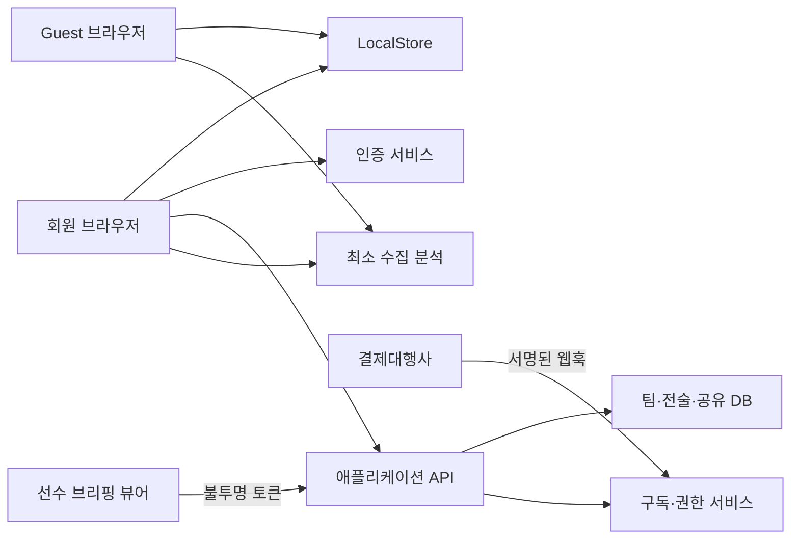

# 스쿼드 메이커 수익화 적용 계획서

- 작성일: 2026-07-20
- 기준 문서: [수익화 전략 제안서](./2026-07-18-monetization-strategy.md)
- 참고 문서: [수익화 전략 리뷰 피드백](./2026-07-18-monetization-strategy-feedback.md)
- 대상 기준점: `origin/main`의 `8f1d0cb`
- 실행 형태: 주당 10~15시간의 사이드 프로젝트
- 상태: 실행 후보 계획 — 각 단계의 진입 게이트를 통과할 때만 다음 단계 착수

## 1. 목표

기존 무료 사용 경험을 유지하면서 다음 수익화 흐름을 단계적으로 구축한다.

1. 비회원이 현재와 동일하게 스쿼드·패턴을 만들고 PNG·GIF·파일·URL로 공유한다.
2. 무료 회원이 팀 1개와 전술 문서 5개를 클라우드에 저장하고 관리형 공유 링크를 사용한다.
3. Pro 코치가 여러 팀, 무제한 전술 문서, 고급 내보내기, 선수별 전술 브리핑과 열람 확인을 사용한다.
4. 실제 사용 데이터가 수요를 증명한 뒤에만 Club 상품을 탐색한다.

최종 제품 목표는 다음과 같다.

> 코치가 한 번 작성한 전술을 여러 경기에서 재사용하고, 선수별로 전달하며, 전원 확인까지 관리할 수 있게 한다.

## 2. 반드시 지킬 제약

### 2.1 무료 기능 불변 조건

다음 기능은 로그인이나 결제를 요구하지 않는다.

- 모든 포메이션과 선수 배치
- 팀·선수 지침
- LocalStorage 자동 저장
- 로컬 선수 명단
- 패턴·단계 생성과 애니메이션 미리보기
- 단일/전체 패턴 GIF
- 현재 화질 PNG
- URL 스냅샷 공유와 비회원 뷰어
- `.sq` 저장·불러오기

### 2.2 데이터 호환성

- 기존 `squad-maker-v1` LocalStorage를 자동 삭제하거나 덮어쓰지 않는다.
- 기존 `#s=` 공유 링크와 스냅샷 `v:1`을 계속 읽는다.
- `.sq` `v:1` 파일을 계속 불러온다.
- 외부 입력은 현재처럼 sanitize 계층을 반드시 통과한다.
- 회원가입·로그인·로그아웃·동기화 실패가 로컬 원본을 손상시키지 않아야 한다.

### 2.3 보안·운영

- 관리자 키, PG 비밀키, 웹훅 비밀값은 브라우저 코드나 저장소에 두지 않는다.
- 요금제 제한은 UI 숨김만으로 구현하지 않고 서버에서도 검증한다.
- 선수는 가입 없이 브리핑을 열람할 수 있어야 한다.
- 선수 브리핑 페이지에는 필요한 선수 정보만 포함한다.
- 기존 정적 앱은 새 서버 기능 장애 시에도 Guest 기능을 계속 사용할 수 있어야 한다.

### 2.4 이번 계획의 비범위

- 광고 네트워크 삽입과 광고 최적화
- Club용 코치 좌석·조직 권한의 실제 구현
- 네이티브 모바일 앱
- 일정·출석·회비·경기 기록을 포함한 종합 팀 관리 기능
- 기존 UI 프레임워크 전면 재작성
- 수요 검증 전 백엔드·PG 제공자 선계약

## 3. 현재 상태와 변경 영향

현재 앱은 `index.html` 한 파일에 UI, 상태, 저장, 공유, PNG/GIF 내보내기가 모두 들어 있다.

| 현재 구성 | 기준 구현 | 수익화 적용 시 영향 |
|---|---|---|
| 앱 상태 | `roster`, `squads`, `patterns` 전역 상태 | 클라우드 문서와 로컬 초안의 경계 필요 |
| 로컬 저장 | `LS_KEY = 'squad-maker-v1'` | 기존 키 보존, 계정 마이그레이션 추가 |
| 문서 직렬화 | `buildStateSnap()` / `restoreState()` | 서버 저장도 동일 스냅샷 계약 사용 |
| 외부 입력 방어 | `sanitizeRoster()` / `sanitizePatterns()` | API·공유·버전 복원 모두 동일 검증 적용 |
| 공개 공유 | `#s=` URL-safe base64 | 계속 무료 유지, 관리형 링크를 별도 추가 |
| 뷰어 | `viewerMode` + 저장 차단 | 공개 링크와 비공개 브리핑 뷰를 분리 |
| 내보내기 | html2canvas, gif.js 클라이언트 실행 | 기존 무료 유지, 고급 내보내기만 별도 기능 |
| 배포 | GitHub Pages 정적 배포 | 프런트 정적 배포 유지 가능, API만 별도 운영 |

## 4. 목표 아키텍처

수요 검증 전에는 단일 파일을 유지한다. 무료 계정 개발에 착수할 때 기존 앱을 Vanilla JS 모듈로 **행동 보존형 분리**하고, 프레임워크 전면 재작성은 하지 않는다.



### 4.1 계획된 코드 구조

0단계에서는 `index.html`만 수정한다. 1단계 모듈화 후 목표 구조는 다음과 같다.

```text
index.html
package.json
vite.config.js
src/
  main.js
  styles/app.css
  core/state.js
  core/sanitize.js
  core/snapshot.js
  storage/local-store.js
  storage/cloud-store.js
  services/analytics.js
  services/auth.js
  services/entitlements.js
  services/managed-shares.js
  services/exports.js
  ui/account.js
  ui/paywall.js
  ui/briefing-viewer.js
server/
  db/migrations/
  functions/account/
  functions/tactics/
  functions/shares/
  functions/billing/
  functions/briefings/
tests/
  unit/
  integration/
  e2e/
```

실제 서버 디렉터리와 배포 명령은 1단계의 백엔드 ADR에서 선택한 제공자에 맞춰 확정한다.

### 4.2 핵심 프런트 인터페이스

아래는 Vanilla JS 구현에서 JSDoc과 런타임 검증으로 지킬 개념적 계약이다.

```ts
// 로컬·클라우드 저장소가 동일한 문서 계약을 사용한다.
export interface TacticStore {
  list(): Promise<TacticSummary[]>;
  get(id: string): Promise<TacticDocument | null>;
  save(document: TacticDocument, expectedVersion?: number): Promise<SaveResult>;
  remove(id: string): Promise<void>;
}

export interface Entitlements {
  tier: 'guest' | 'free' | 'pro';
  maxCloudTeams: number;
  maxCloudDocuments: number | null;
  maxManagedShares: number | null;
  advancedExport: boolean;
  playerBriefings: boolean;
}
```

- `LocalStore`는 항상 사용 가능해야 한다.
- `CloudStore` 장애는 로컬 편집을 차단하지 않는다.
- `Entitlements`는 화면 표시용 캐시이며, 쓰기 API는 서버 권한을 다시 확인한다.
- 분석 호출은 `track(name, properties)` 어댑터 하나로 제한해 도구 교체가 가능하게 한다.

## 5. 데이터 모델 초안

1단계 착수 전에 마이그레이션 파일과 권한 테스트로 확정한다.

| 테이블/컬렉션 | 핵심 필드 | 목적 |
|---|---|---|
| `profiles` | `user_id`, 약관 버전, 가입 시각 | 최소 계정 정보 |
| `teams` | `id`, `owner_id`, `name`, `season_label` | 클라우드 팀 경계 |
| `team_players` | `id`, `team_id`, `display_name`, `color`, `sort_order` | 재사용 가능한 선수 명단 |
| `tactics` | `id`, `team_id`, `owner_id`, `title`, `state_json`, `schema_version`, `version` | 현재 전술 문서 |
| `tactic_versions` | `tactic_id`, `version`, `state_json`, `created_at` | 7일/30일 복구 |
| `managed_shares` | `tactic_id`, `token_hash`, `status`, `expires_at`, `view_count` | 취소 가능한 관리형 링크 |
| `player_briefings` | `tactic_version_id`, `player_id`, `token_hash`, `status`, `expires_at` | 선수별 최소 전술 뷰 |
| `briefing_views` | `briefing_id`, `first_viewed_at`, `last_viewed_at`, `view_count` | 열람 확인 |
| `subscriptions` | `user_id`, `tier`, `status`, `period_end`, `provider_ref` | 서버 권한 기준 |
| `billing_events` | `provider_event_id`, `type`, `processed_at` | 웹훅 멱등성·감사 |

### 5.1 스냅샷 버전 전략

- 1·2단계는 기존 `v:1` 스냅샷을 `state_json`에 저장한다.
- 서버 레코드의 `version`은 동시 수정 제어용이며 스냅샷의 `v`와 별개다.
- 선수별 브리핑에 안정적인 선수 식별자가 필요해지는 3단계에서만 `v:2`를 검토한다.
- `v:2`가 필요하면 `roster`에 선택적 UUID를 추가하고 `v:1 → v:2` 단방향 마이그레이터를 만든다.
- `v:2` 도입 후에도 `v:1` URL과 `.sq`를 읽고, 공개 URL 기본 출력 버전 변경은 별도 결정으로 남긴다.

### 5.2 접근 제어

- 팀·전술·버전은 소유자만 읽고 쓴다.
- 공개 공유와 브리핑은 원본 DB ID가 아닌 128비트 이상의 임의 토큰으로 접근한다.
- DB에는 원문 토큰이 아니라 해시를 저장한다.
- 비공개 뷰어는 `Referrer-Policy: no-referrer`, 검색 차단, 만료·취소 기능을 적용한다.
- 브리핑 뷰에는 전체 팀 지침이나 다른 선수 지침을 내려보내지 않는다.
- 열람 확인은 기본적으로 IP·전체 User-Agent를 보관하지 않고 시각과 횟수만 기록한다.

## 6. 요금제 권한 계약

| 권한 | Guest | Free Account | Pro Coach |
|---|---:|---:|---:|
| 로컬 편집·패턴·PNG·GIF·파일 | 무제한 | 무제한 | 무제한 |
| 기존 `#s=` 공유 | 지원 | 지원 | 지원 |
| 클라우드 팀 | 0 | 1 | 5 |
| 클라우드 전술 문서 | 0 | 5 | 무제한 |
| 관리형 공유 링크 | 0 | 5 | 무제한 |
| 버전 보관 | 없음 | 7일 | 30일 |
| 고급 PNG/PDF/영상 | 없음 | 데모 | 지원 |
| 선수별 브리핑·열람 확인 | 없음 | 데모 | 지원 |

`무제한`은 제품 정책상 제한이 없다는 뜻이며, 악용 방지를 위한 합리적인 속도·용량 제한은 별도 운영 정책으로 둔다.

## 7. 단계별 실행 계획

| 단계 | 기간 가설 | 핵심 결과 | 다음 단계 진입 조건 |
|---|---:|---|---|
| 0단계 | 2~4주 | Guest 회귀 계약, 분석, 수요 신호 | Gate A |
| 1단계 | 6~10주 | 무료 계정, 클라우드, 관리형 공유 | Gate B |
| 2단계 | 6~10주 | Pro 결제, 서버 권한, 고급 내보내기 | Gate C |
| 3단계 | 8~12주 | 선수별 브리핑과 열람 확인 | Gate D |
| 4단계 | 별도 | Club 수동 탐색 | 반복 수요 3개 조직 이상 |

0~3단계의 순수 개발 기간은 총 22~36주 가설이다. 수요 측정, 외부 심사, PG 계약, 법무 검토와 제한 베타 대기 기간은 포함하지 않는다.

### 7.1 0단계 — 기준선·수요 측정 (2~4주)

목표는 백엔드를 만들기 전에 실제 사용과 결제 관심을 측정하는 것이다.

#### Task 0.1 — Guest 회귀 계약 고정

**변경 파일**

- Create: `package.json`
- Create: `tests/e2e/guest-free-regression.*`
- Create: `tests/fixtures/snapshot-v1.json`
- Modify: `README.md`의 검증 방법

**작업**

- 현재 무료 기능의 자동화 가능한 회귀 테스트를 만든다.
- `v:1` URL·파일·LocalStorage 복원 픽스처를 고정한다.
- 390px 모바일과 1280px 데스크톱 핵심 흐름을 검증한다.

**완료 증거**

- 비회원 상태에서 편집, PNG, GIF, 패턴 추가, URL 공유, `.sq` 왕복이 통과한다.
- 공유 링크 열람이 기존 LocalStorage를 변경하지 않는다.
- 현재 라이브 버전과 주요 화면·저장 동작이 동일하다.

#### Task 0.2 — 분석 어댑터와 이벤트 사전

**변경 파일**

- Modify: `index.html`
- Create: `docs/analytics-event-dictionary.md`
- Create: `docs/adr/0001-analytics-provider.md`

**작업**

- Plausible Cloud와 Umami Cloud/자체 호스팅을 비용, 운영 부담, 데이터 위치, 동의 요건으로 비교한다.
- 선택한 도구를 `track()` 어댑터 뒤에 연결한다.
- 선수 이름, 팀명, 지침, 공유 스냅샷과 전체 URL은 분석 속성으로 보내지 않는다.
- 다음 이벤트를 정의한다.
  - `squad_started`, `squad_completed`
  - `image_exported`, `gif_exported`
  - `share_link_created`, `share_link_opened`
  - `cloud_save_interest_clicked`
  - `advanced_export_previewed`
  - `player_briefing_previewed`

**완료 증거**

- 개발 모드에서 각 이벤트가 한 번만 발생한다.
- 분석 요청에 이름·지침·공유 해시가 포함되지 않는다.
- 분석 도구 차단 또는 장애가 앱 기능을 방해하지 않는다.

#### Task 0.3 — 설명형 수요 측정 UI

**변경 파일**

- Modify: `index.html`
- Create: `docs/research/coach-interview-script.md`

**작업**

- 기존 무료 버튼을 바꾸지 않고 `클라우드에 팀 저장`, `고급 영상`, `선수별 브리핑`의 설명형 진입점을 추가한다.
- 클릭하면 기능 가치, 예상 가격, 출시 전 상태를 정직하게 알린다.
- 인터뷰 참여는 별도 명시적 동의 후 받으며, 이메일을 분석 이벤트에 포함하지 않는다.
- 코치 5~8명 인터뷰에서 반복 사용 빈도, 결제 주체, 6,900원 가격 반응을 기록한다.

**완료 증거**

- 기존 무료 기능에 페이월이나 제한이 생기지 않는다.
- 관심 기능별 클릭률을 구분할 수 있다.
- 인터뷰 기록에서 개인정보를 제거한 요약이 남는다.

#### Gate A — 백엔드 착수 여부

다음 조건을 모두 검토해 진행 여부를 기록한다.

- 측정 오류율이 5% 미만이고 4주 또는 완성 세션 200건 이상의 데이터가 있다.
- 활성 제작자의 10% 이상이 유료 후보 기능 중 하나를 확인한다.
- 인터뷰 5~8건 중 최소 3명이 월 6,900원 수준에서 구체적인 결제 의향이나 예산 승인 경로를 설명한다.
- 기준 손익분기 목표인 Pro 25명에 도달할 현실적인 유입 경로가 있다.

조건을 충족하지 못하면 인증·결제를 만들지 않는다. 측정 보정, 가치 제안 변경 또는 유입 확보를 우선한다.

### 7.2 1단계 — 무료 계정·클라우드 저장 (6~10주)

#### Task 1.1 — 출시 전 개인정보·기술 결정

**산출물**

- `docs/adr/0002-frontend-modules.md`
- `docs/adr/0003-backend-provider.md`
- `docs/privacy-data-map.md`
- 개인정보처리방침·이용약관 초안

**결정 기준**

- 인증, DB, 서버 함수, 세분화된 행 권한, 백업·복원, 로그, 국내 사용자 지연시간
- 월 100,000원 기준 운영비 안에서의 예상 비용
- 데이터 내보내기와 서비스 이전 가능성
- 무료 계정 출시 전에 삭제 요청과 계정 탈퇴가 가능한지

#### Task 1.2 — 행동 보존형 모듈화

**변경 파일**

- Create: `src/core/*`, `src/storage/local-store.js`, `src/main.js`, `src/styles/app.css`
- Modify: `index.html`
- Create: `vite.config.js`

**작업**

- `buildStateSnap`, `restoreState`, sanitize, LocalStorage를 먼저 분리한다.
- UI 렌더링과 상태 변이를 나눈다.
- 각 추출 단위마다 Task 0.1 회귀 테스트를 실행한다.
- GitHub Pages 경로와 기존 공유 URL을 유지하도록 빌드 기준 경로를 설정한다.

**완료 증거**

- Guest 회귀 테스트가 모두 통과한다.
- 빌드 결과가 GitHub Pages 하위 경로에서 동작한다.
- `#s=`와 `.sq` `v:1` 픽스처가 그대로 복원된다.

#### Task 1.3 — 인증과 로컬 데이터 연결

**작업**

- 로그인 전 로컬 스냅샷을 백업한다.
- 첫 로그인 시 `로컬 작업을 클라우드에 복사`, `클라우드 문서 열기`, `나중에 결정`을 명시적으로 제공한다.
- 자동 덮어쓰기를 금지하고 같은 콘텐츠의 중복 업로드는 해시로 방지한다.
- 로그아웃 후에도 마지막 로컬 작업은 유지하되 클라우드 전용 목록은 숨긴다.

**완료 증거**

- 가입 취소, 로그인 실패, 네트워크 단절에서 로컬 데이터가 변하지 않는다.
- 다른 계정으로 전환했을 때 이전 계정 문서를 읽을 수 없다.
- 계정 탈퇴와 데이터 삭제 요청 흐름이 실제 서버 데이터까지 삭제한다.

#### Task 1.4 — CloudStore·동기화·충돌 처리

**작업**

- 서버 저장은 `expectedVersion` 기반 낙관적 잠금을 사용한다.
- 로컬 변경은 먼저 LocalStore에 저장하고 네트워크가 가능할 때 CloudStore로 전송한다.
- 버전 충돌 시 `내 로컬본`, `클라우드본`, `복사본으로 둘 다 보관`을 제공한다.
- 저장 상태를 `로컬 저장됨`, `클라우드 동기화 중`, `동기화 완료`, `충돌`로 표시한다.

**완료 증거**

- 오프라인 편집 후 재연결 동기화가 성공한다.
- 두 기기의 동시 수정이 조용히 덮어써지지 않는다.
- 서버 오류 시 `.sq` 백업 경로가 계속 작동한다.

#### Task 1.5 — 무료 할당량과 관리형 링크

**작업**

- Free 계정의 팀 1개, 문서 5개, 관리형 링크 5개를 서버에서 검증한다.
- 한도 도달 시 기존 문서를 읽고 내보내고 삭제할 수 있으며 새 생성만 제한한다.
- 관리형 링크는 제목 변경, 취소, 만료와 총 열람 수를 제공한다.
- 기존 `#s=` 링크는 변경하지 않는다.

**완료 증거**

- 클라이언트 요청을 조작해도 할당량을 초과할 수 없다.
- 링크 취소 후 서버 링크는 열리지 않지만 기존 공개 URL 공유는 정상 동작한다.
- 다른 사용자의 링크 관리 API에 접근할 수 없다.

#### Gate B — 무료 계정 출시

- Guest 회귀 테스트 전부 통과
- 개인정보처리방침, 이용약관, 계정 삭제, 데이터 내보내기 공개
- DB 권한 테스트와 백업 복원 리허설 통과
- 5~10명의 제한 베타에서 데이터 손실 0건
- 가입 완료율, 1주 재방문율, 클라우드 저장 사용률 측정 가능

### 7.3 2단계 — Pro·결제·고급 내보내기 (6~10주)

#### Task 2.1 — 유료 출시 운영 게이트

**완료 선행 조건**

- 사업자등록과 통신판매업 신고 대상 여부 확인
- 국내 정기결제·환불·부분취소·웹훅을 지원하는 PG 선정
- 월 6,900원·연 59,000원 상품, 자동 갱신, 해지·환불 고지 검토
- 결제 실패 재시도와 고객 문의 처리 절차 작성
- PG 수수료를 반영한 손익분기표 갱신

#### Task 2.2 — 서버 구독 상태와 권한

**구독 상태**

```text
trialing -> active -> past_due -> active
                    -> canceled -> expired
```

**작업**

- 결제 성공 화면이 아니라 서명 검증된 웹훅을 구독 상태의 기준으로 삼는다.
- `provider_event_id`를 고유키로 저장해 재전송 웹훅을 한 번만 처리한다.
- 해지 예약 시 기간 종료까지 Pro를 유지하고 종료 후 읽기·내보내기는 허용한다.
- Pro 한도를 초과한 상태로 Free가 되면 기존 데이터는 삭제하지 않고 새 생성만 제한한다.

**완료 증거**

- 중복·역순 웹훅, 결제 실패, 해지 예약, 재구독 통합 테스트가 통과한다.
- 브라우저에서 tier 값을 바꿔도 Pro API를 사용할 수 없다.
- 웹훅 서명 실패와 미등록 이벤트가 안전하게 거부·기록된다.

#### Task 2.3 — 결제·계정 UI

**작업**

- 가격표, 월/연 선택, 7일 체험 또는 1회 결과물 체험 중 Gate A에서 선택한 실험만 구현한다.
- 결제 전 가격, 세금 포함 여부, 갱신 주기, 다음 결제일, 해지 방법을 표시한다.
- 계정 화면에서 구독 상태, 청구 내역 링크, 해지·재구독을 제공한다.

#### Task 2.4 — 고급 내보내기

**작업**

- 기존 PNG·GIF 경로는 수정하지 않는다.
- Pro 경로에 고해상도 PNG/PDF와 MP4 또는 브라우저가 안정적으로 지원하는 영상 포맷을 추가한다.
- 해상도, 재생 속도, 팀명·로고 브랜딩 옵션을 제공한다.
- 브라우저 지원이 부족하면 지원되는 포맷을 안내하고 기존 GIF로 안전하게 돌아간다.

**완료 증거**

- Guest의 기존 PNG·GIF 결과가 기준 픽스처와 동일하다.
- Pro 결과의 해상도·프레임 수·재생 시간이 설정값과 일치한다.
- 내보내기 실패 시 진행 오버레이가 닫히고 재시도할 수 있다.

#### Gate C — 유료 공개

- PG 샌드박스 전체 시나리오 통과
- 실제 소액 결제·해지·환불 1회 운영 리허설 완료
- 가격·갱신·환불 고지와 고객지원 경로 공개
- Pro 권한 우회 보안 테스트 통과
- 제한 베타 결제자에게 치명적 데이터 손실·중복 청구 0건
- 운영비와 Pro 전환율을 반영한 손익분기표 갱신

### 7.4 3단계 — 선수별 전술 브리핑 (8~12주)

#### Task 3.1 — 브리핑 스냅샷과 토큰

- 전술 버전을 고정한 뒤 선수별 브리핑을 생성한다.
- 선수 이름, 해당 선수 위치·지침·관련 패턴만 포함한 최소 응답을 만든다.
- 토큰 생성, 해시 저장, 만료, 취소, 재발급을 구현한다.
- 필요하면 이 단계에서만 스냅샷 `v:2`와 안정적 선수 UUID를 도입한다.

#### Task 3.2 — 비회원 선수 뷰어

- 가입 유도보다 `내 위치`, `개별 지침`, `관련 움직임`을 먼저 표시한다.
- 모바일 390px에서 한 손으로 열람·재생 가능하게 한다.
- 다른 선수·전체 비공개 지침으로 이동할 수 없게 한다.
- 외부 분석·광고 스크립트를 최소화하고 검색 색인을 차단한다.

#### Task 3.3 — 열람 확인

- 첫 열람, 최근 열람, 횟수를 기록한다.
- 같은 세션의 반복 새로고침은 중복 집계하지 않는다.
- 코치 화면에 `미열람`, `열람`, `링크 만료/취소`를 표시한다.
- 선수 계정 없이 열람한 것이므로 사람의 실제 이해를 증명하지 않는다는 문구를 표시한다.

#### Task 3.4 — 코치 전달 워크플로우

- 선수별 링크 일괄 생성과 이름별 복사를 제공한다.
- 링크 생성 전 포함 정보를 미리 보여준다.
- 전술 수정 시 기존 브리핑 유지, 새 버전 발행, 전체 취소 중 선택하게 한다.

#### Gate D — 차별화 가치 검증

- 브리핑 생성 성공률 99% 이상
- 생성된 링크의 7일 내 열람률 측정 가능
- 권한·토큰·캐시에서 다른 선수 정보 노출 0건
- 코치 인터뷰에서 기존 단톡방 전달 대비 시간 절감이 확인됨
- `첫 공유 → 전원 확인` 중앙값을 기준선과 비교 가능

### 7.5 4단계 — Club 탐색

이 단계에서는 제품 기능을 바로 만들지 않는다.

- Pro에서 팀 3개 이상을 운영하는 코치와 인터뷰한다.
- 코치 초대, 역할 권한, 공용 템플릿, 세금계산서 요구를 수집한다.
- 3~5개 조직에 수동 견적·온보딩을 제공한다.
- 같은 요구가 3개 이상 조직에서 반복될 때 별도 Club 설계 문서를 작성한다.

## 8. 테스트 전략

| 계층 | 필수 범위 |
|---|---|
| 단위 | 스냅샷 sanitize·마이그레이션, 권한 계산, 할당량, 충돌 병합, 가격 계산 |
| 통합 | 인증, 소유권, CloudStore, 링크 취소, 웹훅 멱등성, 구독 상태 전이 |
| E2E Guest | 편집, 패턴, PNG/GIF, 공개 공유, `.sq`, LocalStorage 보존 |
| E2E Free | 가입, 로컬 복사, 1팀·5문서·5링크, 기기 간 동기화, 탈퇴 |
| E2E Pro | 결제, 권한 활성화, 고급 내보내기, 해지·만료·재구독 |
| E2E Briefing | 선수별 데이터 격리, 토큰 만료·취소, 열람 확인 |
| 보안 | 다른 사용자 ID 직접 요청, 토큰 추측·재사용, 웹훅 위조, 저장형 XSS |
| 시각 | 390px·768px·1280px에서 Guest/회원/뷰어/결제 상태 |
| 운영 | 백업 복원, 분석 장애, API 장애, PG 장애, 데이터 삭제 요청 |

각 PR은 해당 단계의 기존 테스트와 새 테스트를 모두 통과해야 한다. 서버 기능이 추가된 뒤에도 Guest E2E는 배포 차단 테스트로 유지한다.

## 9. 분석 이벤트 계약

| 퍼널 | 이벤트 | 허용 속성 예시 |
|---|---|---|
| 생성 | `squad_started`, `squad_completed` | 인원제, 패턴 사용 여부 |
| 결과 | `image_exported`, `gif_exported` | 결과 종류, 성공 여부 |
| 공유 | `share_link_created`, `share_link_opened` | 공개/관리형, 생성 후 경과 구간 |
| 가입 | `account_signup_started`, `account_signup_completed` | 로그인 방식 범주 |
| 한도 | `cloud_save_limit_reached`, `managed_share_limit_reached` | tier, 한도 종류 |
| 유료 관심 | `advanced_export_previewed`, `player_briefing_previewed` | 진입 위치 |
| 결제 | `paywall_viewed`, `checkout_started`, `subscription_started` | 월/연, 표시 가격 버전 |
| 유지 | `subscription_cancelled` | 표준화된 취소 사유 코드 |

다음 값은 분석 시스템으로 보내지 않는다.

- 선수·팀 이름
- 팀/선수 지침
- 이메일·결제 식별자
- 전체 공유 URL과 토큰
- 스냅샷 JSON
- 자유 입력 취소 사유 원문

## 10. 배포·롤백 전략

### 10.1 기능 플래그

- `analytics`
- `cloudAccounts`
- `managedShares`
- `billing`
- `advancedExport`
- `playerBriefings`

플래그는 UI 노출을 제어하지만 서버 권한 검증을 대체하지 않는다.

### 10.2 단계별 롤백

| 장애 | 롤백 |
|---|---|
| 분석 스크립트 장애 | 분석 플래그를 끄고 Guest 기능 유지 |
| 인증/API 장애 | 클라우드 UI를 읽기 전용으로 전환하고 LocalStore 편집 유지 |
| 동기화 오류 | 자동 동기화 중단, 로컬본과 `.sq` 내보내기 안내 |
| 결제 장애 | 신규 결제 중단, 기존 권한은 유예 기간 동안 유지 |
| 웹훅 지연 | 마지막 검증 권한을 짧게 캐시하고 서버 재조정 작업 실행 |
| 브리핑 정보 노출 의심 | 브리핑 플래그 비활성화, 전체 토큰 취소, 로그 보존·조사 |

DB 마이그레이션은 확장 후 전환, 안정화 후 제거 순서로 진행한다. 배포와 동시에 기존 컬럼을 삭제하는 마이그레이션은 금지한다.

## 11. 운영·법무 체크리스트

### 무료 계정 공개 전

- [ ] 개인정보 처리방침과 이용약관 공개
- [ ] 수집 항목·목적·보유기간 데이터 맵 확정
- [ ] 계정 탈퇴·데이터 삭제·내보내기 동작 확인
- [ ] 만 14세 미만 선수 정보 처리 흐름 검토
- [ ] 백업 주기와 복원 리허설 완료
- [ ] 침해·데이터 손실 대응 연락 경로 마련

### 유료 베타 전

- [ ] 사업자등록·통신판매업 신고 대상 여부 확인 및 필요 절차 완료
- [ ] PG 계약과 정기결제·해지·환불 정책 확정
- [ ] 가격·세금·자동 갱신·다음 결제일 고지
- [ ] 결제 실패·중복 결제·환불 고객지원 절차 작성
- [ ] 월 고정비·변동비·손익분기표 갱신
- [ ] 실제 소액 결제와 환불 운영 리허설 완료

## 12. PR 분할 원칙

한 PR에 인증·데이터 마이그레이션·결제를 함께 넣지 않는다. 권장 분할은 다음과 같다.

1. `test: lock guest monetization regression contract`
2. `feat: add privacy-safe product analytics`
3. `feat: add monetization interest previews`
4. `refactor: split state and persistence into modules`
5. `feat: add account authentication and local import`
6. `feat: add cloud tactics and conflict handling`
7. `feat: add managed sharing and free quotas`
8. `feat: add subscription entitlements and billing webhooks`
9. `feat: add advanced tactical exports`
10. `feat: add private player briefings`
11. `feat: add briefing view tracking`

각 PR은 독립적으로 롤백 가능해야 하며, 데이터 마이그레이션이 있으면 전방·후방 호환 기간을 명시한다.

## 13. 전체 완료 기준

다음 증거가 모두 있어야 수익화 전략 적용을 완료로 본다.

- [ ] 기존 Guest 무료 기능과 `v:1` 데이터 호환성 회귀 테스트 통과
- [ ] Free 계정의 1팀·5문서·5링크 제한이 서버에서 강제됨
- [ ] 로컬→클라우드 이전과 충돌 해결에서 데이터 손실이 없음
- [ ] Pro 월·연 결제, 실패, 해지, 만료, 재구독이 검증됨
- [ ] 고급 내보내기가 기존 PNG·GIF를 변경하지 않음
- [ ] 선수별 브리핑이 비회원 모바일에서 열리고 다른 선수 정보가 노출되지 않음
- [ ] 열람 확인과 링크 취소·만료가 동작함
- [ ] 개인정보·결제·환불·삭제·백업 운영 체크리스트 완료
- [ ] 분석 대시보드에서 생성→공유→가입→Pro→유지 퍼널을 확인할 수 있음
- [ ] 최신 비용과 전환율로 손익분기표가 갱신됨

## 14. 첫 실행 묶음

승인 후 바로 착수할 범위는 **0단계만**이다.

1. Guest 무료 기능 회귀 테스트 작성
2. 분석 도구 ADR과 이벤트 사전 작성
3. 개인정보를 보내지 않는 분석 어댑터 적용
4. 세 가지 수익화 후보의 설명형 진입점 적용
5. 4주 측정과 코치 5~8명 인터뷰
6. Gate A 회의록 작성 후 1단계 착수 여부 결정

인증, 클라우드 DB, 결제 구현은 Gate A 승인 전 시작하지 않는다.
