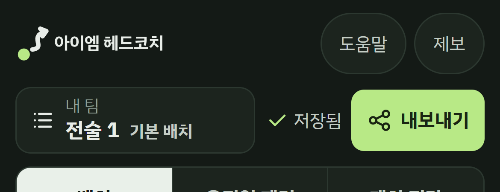
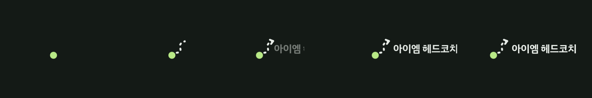

# 01. 적용 사양: 아이엠 헤드코치 (A안, Run Line 위 한글 워드마크)

이 문서는 "무엇을 적용하는가"를 정한다. "어떻게 적용하는가"는 [02-work-request.md](02-work-request.md)에 있다.
이 사양은 Run Line 사양(`docs/branding/run-line/01-design-spec.md`, 원본은 PR #47의 `work/tasks/branding/`)의 **변경분**이다. 여기 없는 규칙(마크 기하, 아이콘, 시스템 스플래시, 모션 앞부분, 접근성, 금지 사항)은 Run Line 사양을 그대로 따른다.

- 선택: 2026-10-10 사용자 선택 "A안 · 최소 변경" (비교 자료 `docs/ux-concepts/brand-headcoach-20261010/`)
- 상태: 국내 상표 확인 전. **확인 결과가 나오기 전에는 운영 코드에 적용하지 않는다.**

## 1. 무엇이 바뀌나

| 항목 | Run Line (PR #47) | 아이엠 헤드코치 A안 |
|---|---|---|
| 워드마크 | `SQUAD MAKER`, Oswald SemiBold 아웃라인 | `아이엠 헤드코치`, IBM Plex Sans KR Bold 아웃라인 |
| 한글 보조 표기 | 인트로에 "스쿼드 메이커"(IBM Plex Sans KR 500, muted) | 없음. 이름 자체가 한글이라 삭제 |
| 로고 접근성 이름 | 스쿼드 메이커 | 아이엠 헤드코치 |
| 마크·아이콘·파비콘·시스템 스플래시·색 | | **변경 없음** |

## 2. 색 (변경 없음, 참고용)

| 토큰 | 값 | 이 사양에서 쓰는 곳 |
|---|---|---|
| night | `#141A16` | 배경. 밝은 바탕용 로고의 글자·선 |
| pitch | `#2B5E3F` | 아이콘·파비콘 바탕 |
| chalk | `#E8EDE8` | 워드마크, 런 라인, 화살촉 |
| lime | `#B8E986` | 선수 토큰 |
| muted | `#8FA096` | 이번 사양에서는 쓰지 않음(보조 표기 삭제) |

명암비: chalk/night 14.9:1. 밝은 바탕용(`*-on-light.svg`)은 글자·선을 night로 칠해 대비가 충분하지만, lime 토큰은 밝은 바탕에서 약 1.4:1이라 그래픽 3:1 기준에 못 미친다. 밝은 바탕용은 인쇄물·외부 문서처럼 어두운 바탕을 쓸 수 없을 때만 쓴다.

## 3. 워드마크 기하

| 항목 | 값 |
|---|---|
| 글꼴 | IBM Plex Sans KR Bold (700), 자간 -0.01em |
| 글자 덩어리 높이 | 44 (viewBox 단위). Run Line 영문 대문자 높이 37보다 크다. 한글은 획이 많아 같은 높이면 작게 읽힌다 |
| 위치 | 글자 시작 x=110, 세로 중심 y=49.5 (위 27.5, 아래 71.5) |
| 가로형 전체 | viewBox `0 0 415.4 100`, 마크 칸 0~100 |
| 워드마크만 | viewBox `0 0 301.4 100` (`wordmark.svg`) |
| 전달 형태 | 아웃라인 경로. 글꼴 파일을 싣지 않는다. 글자를 고치려면 `tools/gen.cjs`로 다시 만든다 |

## 4. 크기별 사용표

| 표시 위치 | 표시 크기 | 파일 | 실측 폭 |
|---|---|---|---|
| 앱 좌상단 헤더 | 높이 28px(모바일), 32px(1024px 이상) | `assets/svg/logo-header.svg` (소형 실선 마크) = `assets/web/header-logo.snippet.html` | 116px / 133px |
| 네이티브 인트로 | 마크 `clamp(56px, 18vmin, 220px)` | `assets/web/brand-intro.snippet.html` | 360px 폭 폰에서 로고 약 269px |
| 공유 이미지·문서 머리 | 높이 40px 이상 | `assets/svg/logo-horizontal.svg` (표준 점선 마크) | 높이 64px일 때 266px |
| 밝은 바탕 | 높이 28px 이상 | `assets/svg/*-on-light.svg` | 위와 같음 |
| 브라우저 탭, Android 아이콘, 스토어 512 | | Run Line 그대로 (`assets/svg/unchanged/`, `assets/png/unchanged/`) | |

- 한글 로고는 높이 28px 미만에 쓰지 않는다. 28px에서 글자 높이가 약 12px이고, 그보다 작으면 "헤", "치"의 획이 뭉친다.
- 로고 주변 여백은 Run Line 사양 §8과 같다.

## 5. 인트로 모션 (변경분만)

| 시간 | 동작 | Run Line과의 차이 |
|---|---|---|
| 0~920ms | 토큰 → 점선 → 화살촉 | 같음 |
| 900~1400ms | 마크가 왼쪽으로 이동 | 같음. 이동 거리 = (워드마크 폭 + 간격) / 2 |
| 1060~1400ms | 워드마크가 왼쪽부터 펼쳐지며 오른쪽으로 0.08m 밀려 들어옴 | Run Line은 960ms 시작, 0.5F 이동. 한글 첫 글자가 이동 중인 화살촉과 겹쳐 늦추고 줄였다 |

- 크기 변수: `--m: clamp(56px, 18vmin, 220px)`, `--gap: m × 0.1`, `--ww: m × 3.054`(워드마크 폭).
- 탭 건너뛰기, 동작 줄이기, 닫힘 조건(모션 끝 + `SquadMakerContract.ready()`, 최대 6초), 웹에서 숨김은 Run Line 스니펫 그대로다.

## 6. 앱 이름 문구

| 위치 | 문구 |
|---|---|
| 앱 이름(Android 런처·설정) | 아이엠 헤드코치 |
| 브라우저 탭·공유 제목 | 아이엠 헤드코치, 축구 포메이션 & 전술 공유 (설명 부분은 기존 문구 유지) |
| 로고·인트로 접근성 이름 | 아이엠 헤드코치 |
| 앱 안 문구("스쿼드 메이커 사용 안내" 등) | 이름 부분만 "아이엠 헤드코치"로 |

런처 라벨은 한 줄만 보여 주는 런처에서 "아이엠 헤…"로 잘린다(`assets/preview/small-sizes-360.png`). 2026-10-10 기본안은 전체 이름 유지다. 줄인 라벨이 필요하면 사용자 결정을 받는다.

## 7. 금지 사항 (Run Line §8에 추가)

- 워드마크를 시스템 글꼴이나 웹 글꼴 `<text>`로 다시 치지 않는다. 아웃라인 경로 파일을 쓴다.
- "아이엠"과 "헤드코치"의 크기·색·굵기를 다르게 하지 않는다(그건 선택되지 않은 B안이다).
- 영문 이름을 함께 쓰지 않는다. 영문 표기가 필요해지면 별도 결정을 받는다.
- 패키지 ID, 저장 키(`squad-maker-*`), 이벤트 이름, `.sq` 형식, 도메인(`squad-maker.vercel.app`), 저장소 이름은 브랜드 전환 범위가 아니다.
