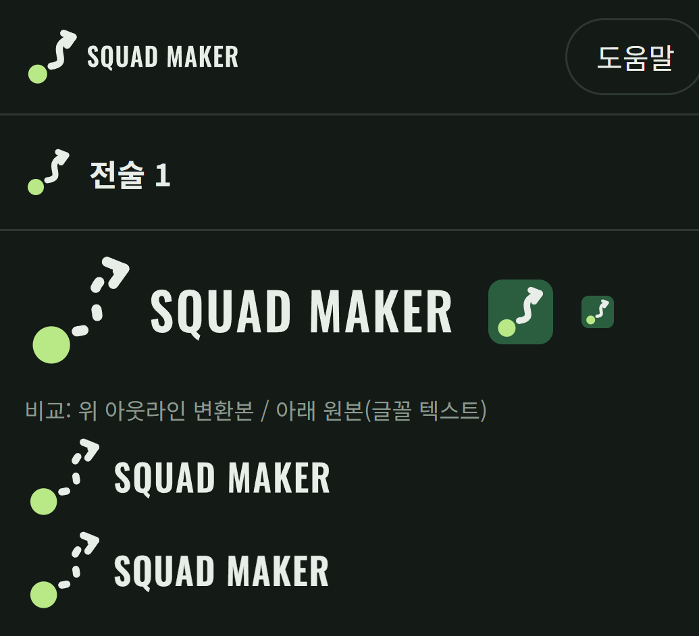
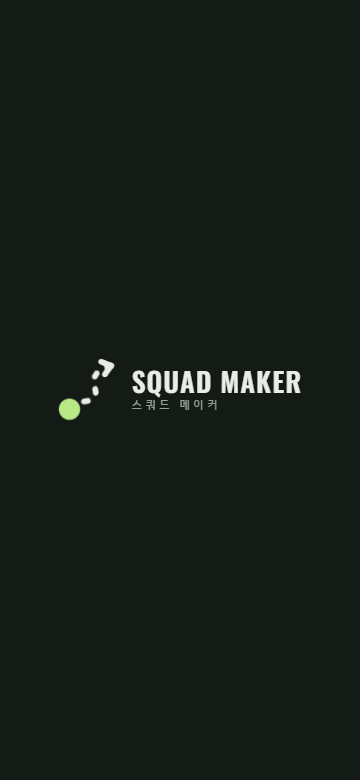
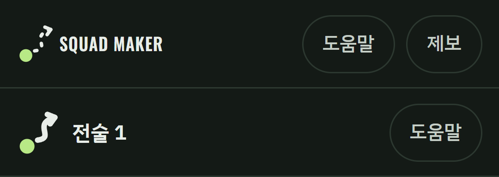

# 01. 적용 시안 — A 런 라인 (Run Line)

이 문서는 "무엇을 적용하는가"를 정한다. "어떻게 적용하는가"는 [02-work-request.md](02-work-request.md)에 있다.
숫자는 모두 SVG 좌표(단위 없음) 기준이며, 운영 에셋은 이 숫자로 이미 만들어져 있다. 손으로 다시 그리지 말고 `assets/` 파일을 쓴다.

## 1. 콘셉트

- **아이디어**: 전술 보드에서 코치가 선수 토큰을 찍고, 그 선수가 뛰어갈 길을 점선 화살표로 그린다. 그 한 동작을 마크로 만들었다.
- **구성 요소 3개**: 라임색 선수 토큰(원) → 분필색 점선 런 라인(살짝 S자로 휘는 곡선) → 끝의 화살촉.
- **말하고 싶은 것**: "선수를 배치하고 움직임을 그린다" = 스쿼드 메이커가 하는 일. 공(⚽)이나 방패 같은 축구 일반 상징을 쓰지 않아 다른 축구 앱과 구별된다.
- **세계관**: A 운영 UI(나이트피치)의 어두운 배경·피치 녹색·분필색·라임 강조를 그대로 쓴다. 새 색을 추가하지 않는다.

## 2. 색

| 토큰 | 값 | 쓰는 곳 |
|---|---|---|
| night (배경) | `#141A16` | 앱 배경, 스플래시 배경, 헤더 바탕 |
| pitch (피치 녹색) | `#2B5E3F` | 앱 아이콘 배경, 파비콘 바탕 |
| chalk (분필) | `#E8EDE8` | 런 라인, 화살촉, 워드마크 |
| lime (라임) | `#B8E986` | 선수 토큰 (마크 안에서 단 하나의 강조) |
| muted | `#8FA096` | 한글 보조 표기 "스쿼드 메이커" |

명암비(WCAG 계산값): chalk/night 14.9, lime/night 12.6, chalk/pitch 6.4, lime/pitch 5.4, muted/night 6.4. 모두 3:1(그래픽 요소) 이상이다.
**pitch 바탕을 night 위에 올리면 2.3:1**이라 경계가 약하다. 아이콘 타일처럼 면으로 쓸 때만 쓰고, 선이나 글자색으로 쓰지 않는다.

## 3. 마크 기하

### 3.1 표준형 (표시 크기 40px 이상)

파일: `assets/svg/run-line-symbol.svg` — viewBox `17 17 67 67`

| 요소 | 값 |
|---|---|
| 선수 토큰 | 원 `cx 33, cy 70, r 11`, 채움 lime |
| 런 라인 중심선 | `M48 62 C78 58 38 36 76 25` (길이 54.802) |
| 점선 | 원래 정의는 `pathLength=100`, `stroke-dasharray 7.3 23.6`. 운영 파일에서는 이 패턴을 **실제 선분 4개로 분해**했다(구간 0–7.3, 30.9–38.2, 61.8–69.1, 92.7–100). |
| 선 굵기·끝 | 6, `stroke-linecap: round` |
| 화살촉 | `M65.8 20.9 L76 25 L69.6 33.9`, 굵기 6, round cap·join |

점선을 분해한 이유: Android VectorDrawable은 `stroke-dasharray`를 지원하지 않고, 렌더러마다 대시 시작 위치가 달라 작은 크기에서 모양이 흔들린다. 분해본은 원본과 픽셀 차 1.3%(안티앨리어싱 수준)로 확인했다.

### 3.2 소형 (표시 크기 16~39px)

파일: `assets/svg/run-line-symbol-small.svg` — viewBox `14 14 72 72`

작으면 점선 간격이 뭉개져 "얼룩"이 된다. 그래서 소형은 **실선**으로 바꾸고 토큰을 키운다.

| 요소 | 값 |
|---|---|
| 선수 토큰 | `cx 31, cy 72, r 12` |
| 런 라인 | `M48 62 C78 58 38 36 76 25` 실선, 굵기 9, round |
| 화살촉 | `M63.9 20.2 L76 25 L68.4 35.5`, 굵기 9, round |

16px 미만에는 마크를 쓰지 않는다(파비콘은 32 캔버스에서 그려 브라우저가 줄인다).

### 3.3 크기별 변형 사용표

| 표시 위치 | 표시 크기 | 사용 파일 | 비고 |
|---|---|---|---|
| 앱 좌상단 헤더 | 높이 28px(모바일), 32px(데스크톱 1024px 이상) | `logo-header.svg` (= `assets/web/header-logo.snippet.html`) | 소형 실선 마크 + 워드마크 |
| 스플래시·온보딩·소개 화면 | 마크 56~220px | 모션 인트로 스니펫 / `logo-horizontal.svg` | 표준 점선 마크 |
| 공유 이미지·문서 머리 | 높이 40px 이상 | `logo-horizontal.svg` | |
| 마크 단독 (큰 크기) | 40px 이상 | `run-line-symbol.svg` | |
| 마크 단독 (작은 크기) | 16~39px | `run-line-symbol-small.svg` | |
| 브라우저 탭 | 16~32px | `favicon.svg` (= `assets/web/favicon.snippet.html`) | 피치 둥근 사각 + 소형 마크 |
| Android 런처 | 48dp | `android/res/` adaptive icon | 표준 점선 마크 (§5) |
| Play 스토어 | 512px | `icon-store-512.svg` → PNG | 풀블리드, 마스크는 스토어가 적용 |

## 4. 워드마크와 가로형 로고

- **영문 워드마크**: `SQUAD MAKER`, Oswald SemiBold(600). 원 정의는 `x 110, y 68, font-size 46, letter-spacing 1.8, textLength 268`(가로 0.938배로 맞춤).
- **운영 파일에서는 글자를 아웃라인 경로로 변환했다.** Android 번들은 Google Fonts를 불러오지 않기 때문에(`scripts/build-android-web.mjs`가 글꼴 링크를 지운다), `<text>`로 두면 기기 기본 글꼴로 바뀐다. 글자를 고치려면 §8의 도구로 다시 만든다.
- **가로형 구성**: viewBox `0 0 384 100`. 왼쪽 100×100 칸에 마크, 오른쪽 x 110~378에 워드마크. 마크와 워드마크의 간격·크기 비율을 바꾸지 않는다.
- **한글 보조 표기** "스쿼드 메이커": 로고 전체 높이 48px 이상일 때만 워드마크 아래에 둔다. IBM Plex Sans KR 500(없으면 Noto Sans KR → 시스템 글꼴), 자간 0.32em, 색 muted. 헤더(28~32px)에는 넣지 않는다.
- **접근성 이름**: 로고를 그림으로 넣을 때 이름은 항상 "스쿼드 메이커"(`aria-label` 또는 `<title>`).

## 5. 앱 아이콘

| 레이어 | 내용 | 파일 |
|---|---|---|
| 배경 | 단색 pitch `#2B5E3F` | `values/ic_launcher_background.xml` |
| 전경 | 표준 점선 마크. 108×108 캔버스에서 `translate(54 54) scale(0.78) translate(-50.5 -49.5)` | `drawable/ic_launcher_foreground.xml`, `svg/icon-foreground.svg` |
| 단색(테마 아이콘, Android 13+) | 전경과 같은 모양, 흰색. 시스템은 알파만 쓴다 | `drawable/ic_launcher_monochrome.xml`, `svg/icon-monochrome.svg` |
| 레거시 PNG (Android 7.x 이하) | 둥근 사각(모서리 18%) `ic_launcher.png`, 원형 `ic_launcher_round.png`, 48/72/96/144/192px | `mipmap-*/` |
| 스토어 | 512×512, 108 캔버스를 4.7407배 | `svg/icon-store-512.svg`, `preview/icon-store-512.png` |

- 전경 마크는 안전 영역(지름 66dp 원) 안, 중심 기준 반경 약 30dp에 들어간다. 원형·물방울·둥근 사각 어느 마스크에서도 화살촉과 토큰이 잘리지 않는다.
- 아이콘에서는 런처 크기(48dp ≈ 마크 실폭 약 26dp)여도 **표준 점선형**을 쓴다. 아이콘은 큰 화면(설정, 앱 정보, 스토어)에서도 보이기 때문이다. 24dp 이하로 보이는 알림 아이콘이 필요해지면 그때 소형 실선형으로 따로 만든다(이번 범위 아님).

## 6. 스플래시 (2단계)

Android 12 이상은 시스템이 앱 시작 직후 스플래시를 직접 그린다. 이 화면에는 GIF·임의 애니메이션을 넣을 수 없다(아이콘 하나 + 배경색, 최대 1000ms짜리 AnimatedVectorDrawable만 가능). 그래서 두 단계로 나눈다.

| 단계 | 누가 그리나 | 보이는 것 | 시간 |
|---|---|---|---|
| ① 시스템 스플래시 | Android (`core-splashscreen`) | 배경 night `#141A16` 단색, 아이콘 없음(투명) | 앱 프로세스·WebView 준비까지 (기기 따라 0.3~1초) |
| ② 앱 안 모션 인트로 | WebView 안 HTML/CSS | 런 라인이 그려지고 워드마크가 펼쳐짐 | 최소 1.4초, 앱 저장소 준비가 끝날 때까지 (최대 6초) |

①과 ②의 배경색이 같아서 사용자는 "어두운 화면 → 로고가 그려짐"으로 끊김 없이 본다.
**아이콘을 투명으로 둔 이유**: 시스템 스플래시에 아이콘을 띄우면 ②에서 마크가 처음부터 다시 그려져 "두 번 나오는" 느낌이 된다. 대안은 §6.3.

### 6.1 모션 타임라인 (총 1400ms, CSS 애니메이션만)

| 시간 | 동작 | 이징 |
|---|---|---|
| 0–260ms | 선수 토큰이 0.2배 → 1배로 튀어나옴(투명 → 불투명) | `cubic-bezier(0.16, 1, 0.3, 1)` |
| 180–780ms | 점선 런 라인이 토큰 쪽에서 화살촉 쪽으로 그려짐 (마스크 `stroke-dashoffset` 100 → 0) | `cubic-bezier(0.45, 0, 0.2, 1)` |
| 740–920ms | 화살촉이 끝점(76, 25) 기준 0.3배 → 1배로 맞물림 | `cubic-bezier(0.16, 1, 0.3, 1)` |
| 900–1400ms | 화면 가운데 있던 마크가 왼쪽으로 이동해 가로형 자리를 잡음 | `cubic-bezier(0.22, 1, 0.36, 1)` |
| 960–1400ms | 워드마크가 왼쪽부터 펼쳐지며(clip-path) 살짝 오른쪽으로 밀려 들어옴 | `cubic-bezier(0.22, 1, 0.36, 1)` |

- 크기: 마크 `--m: clamp(56px, 18vmin, 220px)`, 워드마크 글자 높이 기준 `--F: m × 0.42`. 360px 폭 폰에서 마크 약 65px.
- 반복 애니메이션 없음. 끝나면 정지 상태로 머문다.
- **탭하면 건너뛴다**: 모든 애니메이션을 즉시 끝 상태로(`getAnimations().finish()`). 앱 준비가 안 끝났으면 정지 로고를 보여 준 채 기다린다.
- **동작 줄이기**(`prefers-reduced-motion: reduce`): 애니메이션 없이 정지 로고를 0.4초 보여 주고 닫는다.
- **닫힘**: 모션 끝 + `SquadMakerContract.ready()` 둘 다 충족되면 220ms 페이드아웃 후 DOM에서 제거. 준비가 6초 넘게 걸리면 강제로 닫고, 그 뒤는 앱의 기존 부팅 잠금(`body.ui-booting`)이 이어받는다.
- **웹(브라우저)에서는 보이지 않는다.** 공유 링크로 들어온 사람에게 1.4초 대기를 강요하지 않기 위해 Capacitor 네이티브에서만 켠다.

### 6.2 접근성

- 인트로 전체는 `role="img" aria-label="스쿼드 메이커"` 하나로 읽힌다. 안의 SVG·글자는 `aria-hidden`.
- 깜빡임·번쩍임 없음. 움직이는 시간은 1.4초로 5초 규칙(WCAG 2.2.2) 대상이 아니지만, 탭 건너뛰기와 동작 줄이기를 모두 지원한다.

### 6.3 대안 (지금은 쓰지 않음)

시스템 스플래시에 정지 마크(점선 다 그려진 상태)를 보이고, 웹 인트로는 900ms 지점(마크 이동 + 워드마크 펼침)부터 시작하는 방법. 실기기에서 ①이 1초 넘게 길게 보이면 이 방식으로 바꾼다. 바꾸는 법은 작업요청서 §위험 R3.

## 7. 좌상단 헤더 로고

- 위치: 기존 `<h1 class="wordmark">` 자리. h1 요소와 `wordmark` 클래스는 남기고 안쪽만 SVG로 바꾼다(회귀 테스트가 `h1.wordmark` 노출을 확인).
- 크기: 높이 28px(모바일), 32px(1024px 이상). 너비는 비율대로 자동(28px일 때 약 108px).
- 기존 보조 문구 "전술 보드"(`.wm-sub`)는 뺀다. 로고 옆에 설명 문구를 붙이지 않는다.
- 헤더 바탕은 night. 밝은 바탕에 올리는 경우는 이번 범위에 없다(밝은 바탕용 변형이 필요하면 chalk 대신 night `#141A16`로 칠한 별도 파일을 만든다).

## 8. 금지 사항

- 마크를 늘리거나 눌러 비율을 바꾸지 않는다. 회전·기울이기 금지.
- 토큰 외에 라임을 쓰지 않는다(런 라인을 라임으로 칠하지 않는다). 토큰을 다른 색으로 바꾸지 않는다.
- 40px 미만에서 점선형을 쓰지 않는다(소형 실선형 사용). 16px 미만에는 마크를 쓰지 않는다.
- 워드마크를 다른 글꼴로 다시 치지 않는다(아웃라인 경로 파일을 쓴다).
- 그림자·외곽선·그라데이션·광택 효과를 넣지 않는다.
- 로고 주변 여백은 최소 **토큰 지름만큼**(표준형 기준 viewBox 22단위 = 마크 높이의 약 1/3) 비운다. 헤더처럼 공간이 좁은 곳은 소형 마크 토큰 반지름만큼까지 허용.
- 공(⚽) 이모지 파비콘·아이콘을 함께 쓰지 않는다(이번 작업에서 교체 대상).
