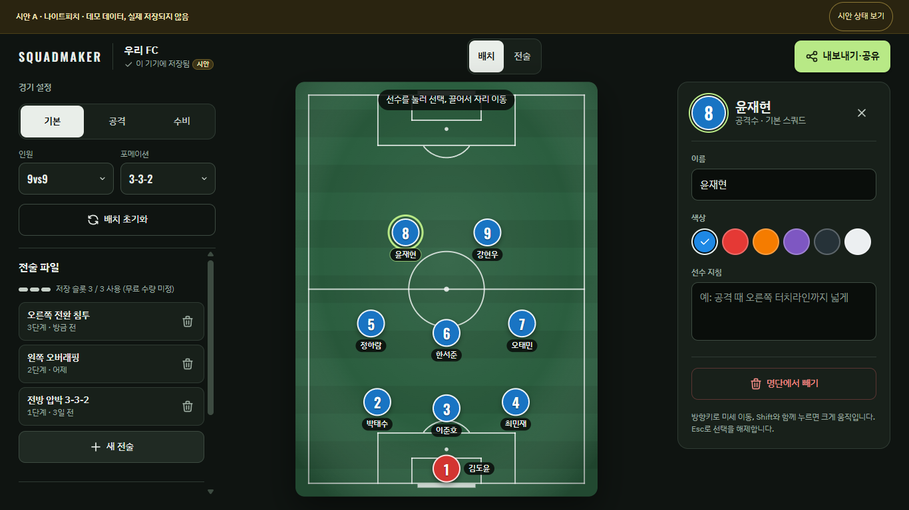
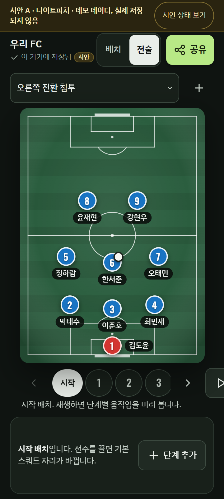

# 선택한 A — 피치 중심 코치형

- 사용자 선택: A. 원본 시안명은 **나이트피치**.
- [최신 상세 기획](../product-plan.md) · [문서 진입점](../README.md)
- 아래 HTML과 PNG는 2026-10-07 Claude 시안의 원본이다. 이동하면서 내용·픽셀을 수정하지 않았다.
- 데모의 저장·처리·오류·되돌리기·슬롯 표시는 시안 상태다. 실제 저장·공유·광고·구매가 연결된 앱이 아니다. 무료 슬롯 “3”은 확정 수량이 아니다.

## 실제 원본

[원본 A 데모](prototype.html)를 브라우저에서 열 수 있다. 외부 스크립트는 없고 글꼴은 Google Fonts 요청을 사용한다. 아래 캡처는 Playwright Chromium의 1366×768 및 360×800 터치 에뮬레이션에서 찍혔다. 실제 Android 검증이 아니다.

| 장면 | 데스크톱 | 모바일 |
|---|---|---|
| 선수 선택·편집 | [원본 PNG](screenshots/a-d-select.png) | [원본 PNG](screenshots/a-m-select.png) |
| 전술·재생 | [원본 PNG](screenshots/a-d-tactic.png) | [원본 PNG](screenshots/a-m-tactic.png) |
| 내보내기·공유 | [원본 PNG](screenshots/a-d-share.png) | [원본 PNG](screenshots/a-m-share.png) |

## 다음 개선 제안 — 원본 캡처에 아직 반영되지 않음

| 항목 | 원본과 계획의 구분 |
|---|---|
| 피치 중심·다크 그린·라임·선수 도구 | A의 실제 구성. 선택한 기본 방향 |
| 읽기 쉬운 이름·상태 라벨 | 짙은 이름 배경은 원본에 있음. 큰 글자/긴 이름·대비·유효 크기 검증은 후속 |
| 모바일 전술 재생 버튼 | 원본 캡처에서 우측 잘림 직접 확인. 단계 줄 재배치와 재생 고정은 개선 제안 |
| 전술 파일 목록 | 원본 모바일 첫 화면 아래에 있음. 헤더에서 항상 목록을 여는 버튼 제안 |
| 이름·현재 상태 동기화 | 원본 소스에 갱신 경로가 있음. 확정 고장으로 단정하지 않고 상태 전환·이름 편집 수용 기준으로 검증 |
| 저장·공유·백업 | 원본은 데모. 실제 영속 저장·성공/실패/취소·복원 보호는 구현 필요 |
| 터치·TalkBack·햇빛 가독성 | 에뮬레이션 측정과 실제 Android 검증을 구분. 실기기 미검증 |

B/C 전체를 선택한 것이 아니다. 파일 목록 접근성을 A에 보완하는 제안이며 C 전체 레이아웃·키프레임 편집 방식 채택을 뜻하지 않는다. [B/C 및 이전 비교안](../archive/ux-redesign-20261007/claude/README.md)은 선택되지 않은 이력으로 보관한다.
