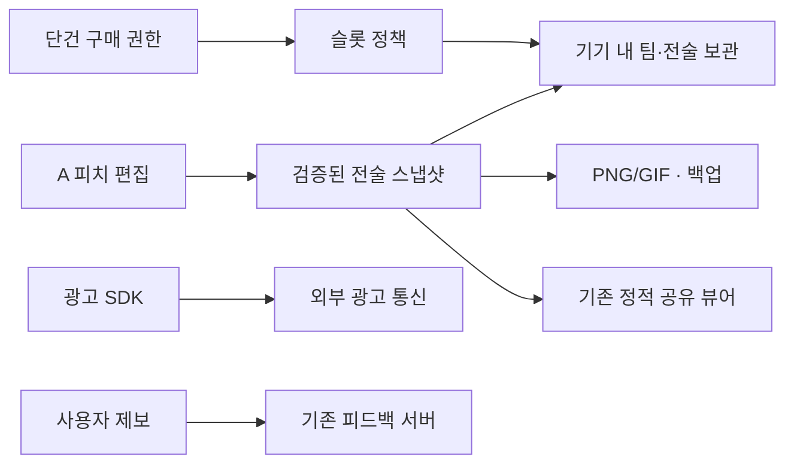

# A 상품 기획: 후속 설계 계약

> **2026-10-08 실행 현황:** 아래는 당시 상품/실행 계획을 보존한 기록이다. 데이터 보호 P0-01~03·C-01, player ID 보정, 계약 v2·로컬 보관·Android preview, Claude A UI와 통합 검증은 후속 실행 문서에 기록됐다. 실제 앱 source는 c081101f이며 unit95/E2E195 통과(기존1skip), unsigned Android/lint 및 기존 preview APK 전달 검증을 마쳤다. [통합 실행 기록](a-preview-release-20261007-tasks.md)과 [현재 계약 v2](ui-state-save-export-contract-v2.md)를 함께 읽는다. 이후 사용자 지시로 **추가 배포·Release 게시를 보류**했으며 아래의 과거 APK 게시 권한이 새 배포를 승인하지 않는다. [2026-10-08 PR 정리](pr-cleanup-20261008-tasks.md)에 최신 상태를 기록한다. 미정 제품 결정과 새 서명키·계정·비밀값 게이트는 유지한다.

- slug: `squad-product-20261007` · orchestrator: Codex
- [상품 기획서](product-plan.md) · [분석](squad-product-20261007-analysis.md) · [작업](squad-product-20261007-tasks.md)
- 상태: **제안**. 현재 구현을 변경하는 기술 사양이 아니다. 미정 제품 결정을 먼저 해소한다.
- UI·시각·반응형·접근성 담당은 Claude로 **확정**. 기능·계약·Android·통합의 Codex 배정은 **제안**이며 [작업계획의 별도 실행 묶음](squad-product-20261007-tasks.md#1-계획의-사용법과-역할)으로 인계한다.

## 1. 책임 경계

피치 편집 상태, 전술 파일 저장, 슬롯 정책, 구매 권한, 내보내기, 광고를 다른 책임으로 다루는 안이다. 현 단일 HTML을 이번 PR에서 분리하지 않는다. Android 프레임워크 선택 때 기존 동작 보존 비용·파일/OS 공유·광고/결제 연동·오프라인·접근성을 작은 실험으로 비교한다. TWA·Capacitor·네이티브 등의 후보를 검토하되 특정 후보를 채택했다고 기록하지 않는다.

화살표는 데이터 책임을 설명한다. 광고 SDK·피드백 서버를 자체 팀 저장 서버로 합치지 않는다. 구매 검증 백엔드 필요 여부는 별도 미정이다. 2차 팀 공간은 새 인증·권한·데이터 모델 검토 후 별도 설계한다.

## 2. 개념 데이터 모델

| 개념 | 제안 필드 | 주의 |
|---|---|---|
| 팀 프로젝트 | id, name, createdAt, updatedAt | 전술 파일의 그룹. 팀 공통 명단 상속/동기화는 미확정 |
| 전술 파일 | id, teamId, title, schemaVersion, revision, snapshot | 기본/공격/수비와 패턴을 포함하는 안 |
| 파일 내용 | 현 v:1 roster/squads/pat 등 | 실제 필드는 현 snapshot 계약에서 추출. 매치 입력의 영속화는 별도 제안이며 현재 v:1에 없음 |
| 목록 요약 | fileId, title, updatedAt, saveStatus | 원본 저장 성공 후 일관되게 갱신 |
| 슬롯 정책 | policyVersion, unit, freeCapacity | 모두 사용자 결정 뒤 확정. 시안 숫자 사용 금지 |
| 구매 권한 | 확인된 상품·권한량·처리 식별·검증 상태 | 전술 백업/공유 문서와 분리. 민감 원문을 문서·로그에 기록하지 않음 |
| 복구 상태 | 변경 전 스냅샷, 대상, 저장 revision | 메모리 undo와 영구 복구의 보장 범위를 구분 |

팀=프로젝트·전술=파일은 확정된 사용 개념이다. 전술 파일 단위 슬롯·팀 명단 상속·파일 복제·장기 휴지통은 제안이며 자동으로 출시 범위에 넣지 않는다.

## 3. 상태 전이와 안전성

| 동작 | 성공 단위 | 취소·실패 |
|---|---|---|
| 기존 파일 편집 | 스냅샷+목록 수정 시각 저장 후 저장됨 | 이전 성공본 보존·입력 유지·지속 경고/백업 |
| 신규 파일 | 단위 확인→검증→저장→사용량 반영 | 슬롯 수와 원본 무변경 |
| 파일 교체 복원 | 파일 요약/영향 확인→이전본 캡처→sanitize→저장→재읽기 | 기존 파일 보존. 되돌리기는 이전본을 다시 저장 |
| 삭제 | 영향 확인→파일/카운터 함께 변경 | 취소 무변경. 되돌리기 충돌이면 새 파일 자동 삭제 금지 제안 |
| 인원 변경 | 사용자 편집 탐지→잃는 대상 설명→진행 시 복구 캡처→저장 | 취소·되돌리기 후 이름·세 상태·패턴·지침 유지 |
| 현재 배치 초기화 | 해당 상태 범위 안내→복구본→저장 | 다른 상태 영향 없음. 되돌리기 후 재시작 유지 |
| 공유 URL 열기 | 읽기 전용 검증·렌더링 | localStore 쓰기 금지. 가져오기만 명시적 변경 |
| 구매 | 스토어 확인→멱등 권한 반영→UI 갱신 | 취소/보류/오류는 기존 권한·파일 유지 |

되돌리기 메시지의 표시 시간·앱 종료 후 복구 범위는 후속 결정이다. 기존 메모리 undo를 기기 분실·삭제 복구로 설명하지 않는다. 저장 공간 오류가 발생했을 때 “성공” 메시지를 먼저 띄우지 않는다.

## 4. A 화면 계약

데스크톱은 피치 중심과 가까운 선수 도구를 유지한다. 모바일은 헤더(팀/파일/저장/목록) → 작업 탭 → 상태·설정 → 피치 → 선택 도구/단계·재생 순서를 우선 검토한다. 화면 높이·키보드 때문에 필요하면 도구를 접근 가능한 시트로 연다. 피치와 주요 도구의 동시 사용성을 실제 기기에서 확인한다.

목록 시트는 파일 이름·수정 시각·사용량과 새 파일/삭제를 제공하는 안이다. 열기·닫기·Android 뒤로 가기는 현재 편집 상태·선택·스크롤을 잃지 않아야 한다. A의 파일 접근성을 보완하는 것으로 C의 전체 사이드바·키프레임 작업 체계를 도입하지 않는다.

내보내기·공유 시트의 결과물(PNG/GIF), 전달(링크/텍스트), 편집 원본(.sq)을 분명한 라벨로 나눈다. 시트가 닫혀도 피치 원본은 유지된다. 선택 상태가 바뀌면 헤더·선수 도구·결과 미리보기에도 같은 이름을 표시한다.

## 5. 버전과 이전 계약

새 저장소 형식 버전과 현 snapshot `v:1`을 분리한다. 변환은 복사본에서 수행하고 sanitize·저장·재읽기 검증이 끝나기 전 원본을 변경하지 않는 안이다. 지원 불가 버전은 오류를 표시하며 자동 삭제·초기화로 복구하지 않는다. 브라우저 로컬 데이터를 Android에서 직접 읽을 수 있다고 전제하지 않는다.

기존 입력 종류(localStorage/.sq/#s=), 구형 패턴, 비정상 좌표·이름·배열·JSON·알 수 없는 버전을 테스트한다. fixture와 원본 증거는 유지한다. 백업 범위(전술/팀/전체), ID 중복 처리, 복원 시 슬롯 충돌과 rollback은 단위 결정 뒤 구체화한다.

## 6. 구매 복원과 초과 정책

영구 확장 상품은 스토어 계정에서 복원 가능한 권한으로 설계한다. 반복 확장 시 상품·구매 식별 기록이 필요한지 검증한다. 단순 로컬 숫자 증가나 파일에 담긴 권한만 믿지 않는다. 로그인 없는 앱은 서비스 계정과 스토어 계정을 구분해서 설명한다.

환불 시 초과 파일 자동 삭제 금지는 제안이다. 기존 파일의 열기·백업을 보호하면서 추가 생성 제한 등을 검토한다. 조회 장애를 취소된 권한으로 단정하지 않는다. 검증 서버 필요 여부·오프라인 캐시·환불 반영 시점·기기 간 복원은 구매 착수 전 미정 항목이다.

## 7. 대안과 검증

| 선택 | 이점 | 해결할 질문 |
|---|---|---|
| 전술 파일 단위 슬롯 (제안) | 사용자가 목록에서 세기 쉬움 | 팀/패턴과 경계, 이전본 한도 |
| 팀 프로젝트 단위 슬롯 | 팀별 보관량을 설명하기 쉬움 | 팀 안 전술 무제한 여부·프로젝트 이동 영향 |
| 기존 v:1 payload 감싸기 | 읽기 계약 보존과 이전 위험 감소 | 새 파일 메타데이터/공유 컨테이너 버전 |
| Android 후보 비교 | 기존 자산 재사용 또는 네이티브 조작 개선 | OS 저장·공유·광고·구매·오프라인·접근성 실제 실험 |

D1~D3 손실 재현과 보호 회귀를 먼저 완료하고 새 저장소·시각 변경을 한다. 실제 Android 재현, 데이터 이전·구매 테스트, 개인정보 통신 실측은 후속 구현 검증이다. 이번 PR은 링크·자산·범위 검증만 수행한다.

## 8. UI 인계 계약 v0 (제안)

이 절은 **인계 준비를 위한 의미 계약 초안**이다. 실제 API·새 저장 형식·모듈이 이미 구현되었다는 뜻이 아니다. C-01에서 현재 소스의 이벤트와 결과를 매핑하고 fixture/테스트로 확정한 뒤 버전을 올린다. UI가 로컬 카운터·저장 성공·구매 권한을 추측해서 만들지 않도록 기능 의미를 먼저 고정한다.

### 책임과 입력

| 계약 영역 | Codex 기능 담당 (제안) | Claude UI 담당 (확정) |
|---|---|---|
| 편집 상태 | 상태 전이·선택 ID·유효성·변경 영향·undo·revision | 피치/이름/상태 라벨·선택 도구·확인/취소/되돌리기 표시 |
| 로컬 저장 | 검증·원자적 저장/재읽기·이전·오류·목록/카운터 일관성 | 저장중/저장됨/실패·목록/빈 상태/한도/재시도 안내 |
| 내보내기/공유 | 사용할 스냅샷·PNG/GIF/.sq 생성·OS adapter·성공/취소/오류 | 결과물/전달/원본 라벨·미리보기·시트/포커스·취소 UI |
| 구매/광고 (해당 단계) | 권한 확인·멱등 복원·SDK 상태·동의/통신 처리 | 계약에 따른 안내·레이아웃. 도입 결정과 SDK 로직은 UI가 정하지 않음 |

UI에 제공할 상태의 **개념 필드**는 현재 팀/파일 식별·표시명, 편집 중 기본/공격/수비 상태, 선택 선수 ID와 이름, 검증된 피치/패턴 스냅샷, revision, 저장 상태/오류, 목록 요약, 확정 정책의 슬롯 상태다. 실제 필드명과 소유권은 C-01에서 매핑한다. 파일 ID와 revision은 새 로컬 보관 제안이며 현 v:1에 있다고 적지 않는다.

현재 교환 payload는 `v/team/mode/squad/roster/squads/pat`다. 런타임 표시 상태·선택·오류·권한 메타데이터를 곧바로 이 payload에 넣지 않는다. 새 컨테이너와 현 `v:1`의 버전/이전 규칙을 구분하고, 미확정 매치 영속화를 추가하지 않는다.

### 동작과 결과 의미

아래 이벤트 이름은 설명용이며 공개 함수명·라이브러리 선택이 아니다.

| UI 요청/상황 | 기능 계약에서 확정할 결과 | UI 수용 기준 |
|---|---|---|
| 선수 선택·이름/배치/상태 변경 | 동일 선택 ID·상태·revision의 갱신 결과, 영향 범위 | 헤더·선수 도구·미리보기의 이름/상태가 일치. 기본/공격/수비를 파일 3개로 세지 않음 |
| 인원 변경·초기화 | 잃는 대상·복구 가능 범위, 확인 후 변경, 취소 무변경, undo의 저장 결과 | 지침만 경고하지 않음. 초기화 대상 상태를 표시하고 되돌리기 후 실패/성공을 구분 |
| 파일 열기·목록/시트 닫기 | 저장중/미저장/실패 시 처리 정책, 닫기 취소 결과 | 다른 파일을 여는 위험은 기능 정책에 따름. 목록/공유 시트만 닫으면 원본·선택 보존 |
| 편집 자동저장 | 변경 revision과 저장 완료 revision, 저장중/성공/실패·이전 성공본 | 저장 확인 전에 “저장됨” 표시 금지. 수정/자동저장은 슬롯 차감 없음 |
| 새 파일·삭제·복원 | 확정 단위의 수용 가능 여부, 영향·ID 충돌·검증/저장/카운터 결과 | 가득 차도 기존 파일 편집 가능. 취소/실패는 원본·카운터 보존. 복구 범위는 Q9 결정대로 표시 |
| .sq 가져오기/이전 | 버전·sanitize·원본 보호·저장/재읽기 결과, 지원 불가/실패 | 파싱만 성공한 것을 복원 완료로 표시하지 않음. 완료 후 재시작 유지 확인 |
| PNG/GIF/원본 생성 | 요청 시 기준 스냅샷/revision과 결과 파일·준비/완료/오류 | 표시 이름/상태/단계와 결과가 일치. 생성 중 편집 가능 여부는 먼저 계약으로 정함 |
| OS 저장·공유 | 성공/취소/오류를 구분하는 결과, 플랫폼이 확인 가능한 완료 범위 | 사용자 취소를 장애로 알리지 않음. 공유 시트를 열었다고 수신자 전달 완료를 주장하지 않음 |
| 읽기 전용 공유 URL | 검증·렌더링, 로컬 쓰기 없음; 명시적 가져오기는 별도 동작 | 열람으로 기기 전술/슬롯을 바꾸지 않음 |
| 구매 복원 (도입 시) | 확인된 권한·보류/실패/취소·멱등 결과 | 구매 권한과 삭제된 로컬 파일 복구를 구분. 정기 구독을 전제하지 않음 |

성공/취소/오류의 결과 종류, 재시도 가능 여부와 되돌리기 대상은 구조적으로 전달하는 안이다. 저장 공간 오류·지원 불가 버전·슬롯 부족·이전 충돌 등은 사용자에게 알릴 수 있는 사유로 매핑한다. 구체적 오류 코드·표시 문구는 계약 확정 시 맞춘다. 민감 구매 값·토큰·원본 개인 데이터를 진단 로그로 노출하지 않는다.

### 계약 검증과 변경

C-01의 인계에는 정상·빈 목록·긴 이름·기본/공격/수비 전환·저장중/실패·슬롯 가득 참·복원 오류·export 오류·공유 취소 fixture가 필요하다. Claude U-01은 이 fixture로 화면을 상세화하고 U-02는 인계된 계약만 사용한다. fixture의 한도 숫자는 테스트용임을 표시하며 상품의 무료량·가격으로 사용하지 않는다.

계약 버전·검증 head SHA·허용 파일·확정 Q 번호·미정 사항을 [인계 표](squad-product-20261007-tasks.md#3-인계와-공유-파일-소유권)에 기록한다. 이벤트/저장/취소/undo 의미가 바뀌면 기능 담당이 계약과 테스트를 먼저 갱신하고 UI 담당에게 새 기준을 인계한다. 동일 index.html은 순차 사용하거나 먼저 책임 경계를 확보한다. C-02에서 경계/인계 규칙을 정하고 C-03까지 완료·검증한 최종 SHA를 U-02 운영 UI의 실제 기준으로 넘긴다. 통합 검증 담당(Codex 제안)은 기능 회귀와 Claude UI 증거를 모두 수용한 뒤 Android 작업으로 넘긴다.

## 9. 설치 확인용 APK 공급 계약 (제안)

지정 PC 세션에서 빌드하고 검증한 **동일 파일**을 GitHub Releases로 전달한다. APK·SHA-256·앱 버전/versionCode·빌드 기준 커밋·포함/미포함 기능·테스트 서명인지 정식 배포 서명인지·검증 환경·설치/업데이트 안내를 함께 제공한다. 키 원문이나 다른 앱의 앱 ID·서명·토큰을 가져오지 않는다. 새 자격 증명/영구 접근 설정은 필요 범위와 책임을 구체화한 뒤 승인받는다.

검증이 끝난 파일의 해시·크기·버전·서명을 업로드 후 다운로드 파일과 비교한다. 이미 게시한 자산을 교체해 이전 검사와 다른 파일을 배포하지 않는다. 수정은 새 빌드로 제공하고 기존 설치 데이터·서명 호환을 확인한다. 시험 서명에서 정식 서명으로의 업데이트 가능 여부는 별도로 확인한다.

참고 저장소는 `jaywapp/gyungchung-mobile`(앱/검사/빌드)과 `jaywapp/gyungchung-releases`(APK 자산)로 확인했다. 그 저장소의 체크섬·동일 파일 설치 검증·draft 자산 확인·버전별 게시 구조만 참고한다. Expo/React Native 선택·회원 서버·앱 내부 자동 업데이트·푸시를 신규 필수 기능으로 가져오지 않는다. 별도 공개 배포 저장소를 자동 생성하거나 새 영구 권한을 설정하지 않는다.

[A-04](squad-product-20261007-tasks.md#a-04-설치-확인용-apk와-github-releases)는 초기 제한 범위 APK와 A 통합 이후 APK를 구분한다. 테스트용 정책 fixture는 실제 무료량·가격·상품 결정이 아니다. 광고/구매 SDK·동의 UI를 추가한 새 빌드는 해당 기능과 저장/공유/접근성을 다시 검사해야 한다. 시험 APK 제공과 Play Store 첫 출시 완료 기준은 별개다.
