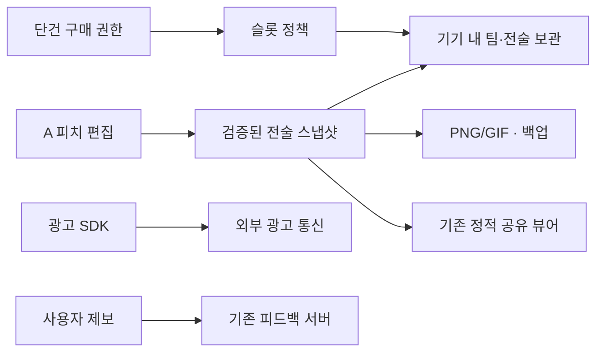

# A 상품 기획: 후속 설계 계약

- slug: `squad-product-20261007` · orchestrator: Codex
- [상품 기획서](product-plan.md) · [분석](squad-product-20261007-analysis.md) · [작업](squad-product-20261007-tasks.md)
- 상태: **제안**. 현재 구현을 변경하는 기술 사양이 아니다. 미정 제품 결정을 먼저 해소한다.

## 1. 책임 경계

피치 편집 상태, 전술 파일 저장, 슬롯 정책, 구매 권한, 내보내기, 광고를 다른 책임으로 다루는 안이다. 현 단일 HTML을 이번 PR에서 분리하지 않는다. Android 프레임워크 선택 때 기존 동작 보존 비용·파일/OS 공유·광고/결제 연동·오프라인·접근성을 작은 실험으로 비교한다. TWA·Capacitor·네이티브 등의 후보를 검토하되 특정 후보를 채택했다고 기록하지 않는다.

화살표는 데이터 책임을 설명한다. 광고 SDK·피드백 서버를 자체 팀 저장 서버로 합치지 않는다. 구매 검증 백엔드 필요 여부는 별도 미정이다. 2차 팀 공간은 새 인증·권한·데이터 모델 검토 후 별도 설계한다.

## 2. 개념 데이터 모델

| 개념 | 제안 필드 | 주의 |
|---|---|---|
| 팀 프로젝트 | id, name, createdAt, updatedAt | 전술 파일의 그룹. 팀 공통 명단 상속/동기화는 미확정 |
| 전술 파일 | id, teamId, title, schemaVersion, revision, snapshot | 기본/공격/수비와 패턴을 포함하는 안 |
| 파일 내용 | 현 v:1 roster/squads/pat 등 | 실제 필드는 현 snapshot 계약에서 추출. 매치 입력의 영속화는 별도 제안이며 현재 v:1에 없음 |
| 목록 요약 | fileId, title, updatedAt, saveStatus | 원본 저장 성공 후 일관되게 갱신 |
| 슬롯 정책 | policyVersion, unit, freeCapacity | 모두 사용자 결정 뒤 확정. 시안 숫자 사용 금지 |
| 구매 권한 | 확인된 상품·권한량·처리 식별·검증 상태 | 전술 백업/공유 문서와 분리. 민감 원문을 문서·로그에 기록하지 않음 |
| 복구 상태 | 변경 전 스냅샷, 대상, 저장 revision | 메모리 undo와 영구 복구의 보장 범위를 구분 |

팀=프로젝트·전술=파일은 확정된 사용 개념이다. 전술 파일 단위 슬롯·팀 명단 상속·파일 복제·장기 휴지통은 제안이며 자동으로 출시 범위에 넣지 않는다.

## 3. 상태 전이와 안전성

| 동작 | 성공 단위 | 취소·실패 |
|---|---|---|
| 기존 파일 편집 | 스냅샷+목록 수정 시각 저장 후 저장됨 | 이전 성공본 보존·입력 유지·지속 경고/백업 |
| 신규 파일 | 단위 확인→검증→저장→사용량 반영 | 슬롯 수와 원본 무변경 |
| 파일 교체 복원 | 파일 요약/영향 확인→이전본 캡처→sanitize→저장→재읽기 | 기존 파일 보존. 되돌리기는 이전본을 다시 저장 |
| 삭제 | 영향 확인→파일/카운터 함께 변경 | 취소 무변경. 되돌리기 충돌이면 새 파일 자동 삭제 금지 제안 |
| 인원 변경 | 사용자 편집 탐지→잃는 대상 설명→진행 시 복구 캡처→저장 | 취소·되돌리기 후 이름·세 상태·패턴·지침 유지 |
| 현재 배치 초기화 | 해당 상태 범위 안내→복구본→저장 | 다른 상태 영향 없음. 되돌리기 후 재시작 유지 |
| 공유 URL 열기 | 읽기 전용 검증·렌더링 | localStore 쓰기 금지. 가져오기만 명시적 변경 |
| 구매 | 스토어 확인→멱등 권한 반영→UI 갱신 | 취소/보류/오류는 기존 권한·파일 유지 |

되돌리기 메시지의 표시 시간·앱 종료 후 복구 범위는 후속 결정이다. 기존 메모리 undo를 기기 분실·삭제 복구로 설명하지 않는다. 저장 공간 오류가 발생했을 때 “성공” 메시지를 먼저 띄우지 않는다.

## 4. A 화면 계약

데스크톱은 피치 중심과 가까운 선수 도구를 유지한다. 모바일은 헤더(팀/파일/저장/목록) → 작업 탭 → 상태·설정 → 피치 → 선택 도구/단계·재생 순서를 우선 검토한다. 화면 높이·키보드 때문에 필요하면 도구를 접근 가능한 시트로 연다. 피치와 주요 도구의 동시 사용성을 실제 기기에서 확인한다.

목록 시트는 파일 이름·수정 시각·사용량과 새 파일/삭제를 제공하는 안이다. 열기·닫기·Android 뒤로 가기는 현재 편집 상태·선택·스크롤을 잃지 않아야 한다. A의 파일 접근성을 보완하는 것으로 C의 전체 사이드바·키프레임 작업 체계를 도입하지 않는다.

내보내기·공유 시트의 결과물(PNG/GIF), 전달(링크/텍스트), 편집 원본(.sq)을 분명한 라벨로 나눈다. 시트가 닫혀도 피치 원본은 유지된다. 선택 상태가 바뀌면 헤더·선수 도구·결과 미리보기에도 같은 이름을 표시한다.

## 5. 버전과 이전 계약

새 저장소 형식 버전과 현 snapshot `v:1`을 분리한다. 변환은 복사본에서 수행하고 sanitize·저장·재읽기 검증이 끝나기 전 원본을 변경하지 않는 안이다. 지원 불가 버전은 오류를 표시하며 자동 삭제·초기화로 복구하지 않는다. 브라우저 로컬 데이터를 Android에서 직접 읽을 수 있다고 전제하지 않는다.

기존 입력 종류(localStorage/.sq/#s=), 구형 패턴, 비정상 좌표·이름·배열·JSON·알 수 없는 버전을 테스트한다. fixture와 원본 증거는 유지한다. 백업 범위(전술/팀/전체), ID 중복 처리, 복원 시 슬롯 충돌과 rollback은 단위 결정 뒤 구체화한다.

## 6. 구매 복원과 초과 정책

영구 확장 상품은 스토어 계정에서 복원 가능한 권한으로 설계한다. 반복 확장 시 상품·구매 식별 기록이 필요한지 검증한다. 단순 로컬 숫자 증가나 파일에 담긴 권한만 믿지 않는다. 로그인 없는 앱은 서비스 계정과 스토어 계정을 구분해서 설명한다.

환불 시 초과 파일 자동 삭제 금지는 제안이다. 기존 파일의 열기·백업을 보호하면서 추가 생성 제한 등을 검토한다. 조회 장애를 취소된 권한으로 단정하지 않는다. 검증 서버 필요 여부·오프라인 캐시·환불 반영 시점·기기 간 복원은 구매 착수 전 미정 항목이다.

## 7. 대안과 검증

| 선택 | 이점 | 해결할 질문 |
|---|---|---|
| 전술 파일 단위 슬롯 (제안) | 사용자가 목록에서 세기 쉬움 | 팀/패턴과 경계, 이전본 한도 |
| 팀 프로젝트 단위 슬롯 | 팀별 보관량을 설명하기 쉬움 | 팀 안 전술 무제한 여부·프로젝트 이동 영향 |
| 기존 v:1 payload 감싸기 | 읽기 계약 보존과 이전 위험 감소 | 새 파일 메타데이터/공유 컨테이너 버전 |
| Android 후보 비교 | 기존 자산 재사용 또는 네이티브 조작 개선 | OS 저장·공유·광고·구매·오프라인·접근성 실제 실험 |

D1~D3 손실 재현과 보호 회귀를 먼저 완료하고 새 저장소·시각 변경을 한다. 실제 Android 재현, 데이터 이전·구매 테스트, 개인정보 통신 실측은 후속 구현 검증이다. 이번 PR은 링크·자산·범위 검증만 수행한다.
