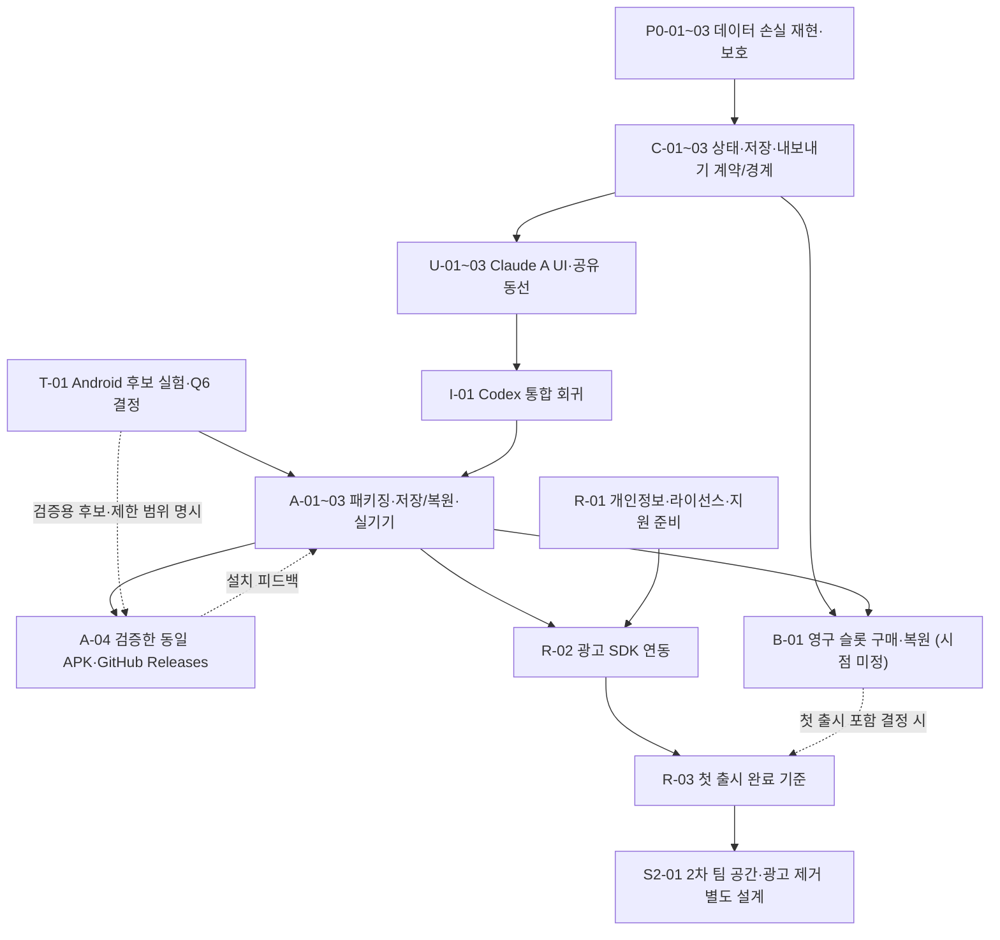

# A 상품 실행 로드맵과 작업계획

> **2026-10-08 실행 현황:** 아래는 당시 상품/실행 계획을 보존한 기록이다. 데이터 보호 P0-01~03·C-01, player ID 보정, 계약 v2·로컬 보관·Android preview, Claude A UI와 통합 검증은 후속 실행 문서에 기록됐다. 실제 앱 source는 c081101f이며 unit95/E2E195 통과(기존1skip), unsigned Android/lint 및 기존 preview APK 전달 검증을 마쳤다. [통합 실행 기록](a-preview-release-20261007-tasks.md)과 [현재 계약 v2](ui-state-save-export-contract-v2.md)를 함께 읽는다. 이후 사용자 지시로 **추가 배포·Release 게시를 보류**했으며 아래의 과거 APK 게시 권한이 새 배포를 승인하지 않는다. [2026-10-08 PR 정리](pr-cleanup-20261008-tasks.md)에 최신 상태를 기록한다. 미정 제품 결정과 새 서명키·계정·비밀값 게이트는 유지한다.

- slug: `squad-product-20261007` · **이번 문서 작업 orchestrator: Codex**
- [상품 기획](product-plan.md) · [분석](squad-product-20261007-analysis.md) · [설계·UI 계약](squad-product-20261007-design.md) · [선택된 A 자료](design-a/README.md)
- **확정:** A 피치 중심 코치형, Android 첫 출시, UI·시각·반응형·접근성 작업은 Claude 담당.
- **제안:** 데이터 보호·저장·회귀·Android·SDK·통합 검증은 Codex 담당. 아래 모델 계열·추론 수준은 저장소 지침에 따른 추천이며 실행 배정 완료나 특정 최신 버전 보장이 아니다.
- **현재 스레드 범위:** 기존 계획을 구체화하는 문서 작업과 지원되는 앱 도구를 통한 지정 세션 확인. 앱 코드·설정·배포는 변경하지 않는다.
- **후속 APK 권한:** 사용자는 지정 세션에서 자율 진행하고 설치 확인용 APK를 GitHub Releases에 게시하는 것까지 승인했다. 테스트용 APK와 정식 배포 서명을 구분하고, 새 서명 자격 증명·영구 접근 설정이 필요하면 구체적 승인을 받는다. 다른 앱의 키·앱 ID는 재사용하지 않는다.
- **후속 실행 권한:** 사용자는 계획 완료 후 PC의 기존 이름 `squad-maker` Codex 세션에서 작업하고, 같은 이름으로 준비한 Claude 세션에 UI를 맡기도록 지정했다. 실제 세션 ID·저장소 경로·최근 상태를 확인한 뒤 해당 세션으로 인계한다. 아래 `blocked`는 착수/결정/선행 증거가 아직 확인되지 않은 상태이며 구현 권한을 다시 요청한다는 뜻이 아니다. 미정 제품·보안·계정 결정은 해당 게이트를 유지한다.

## 1. 계획의 사용법과 역할

이 파일은 최신 로드맵의 단일 진입점이다. Claude와 Codex를 섞은 한 실행 세션을 뜻하지 않는다. [AGENTS](../AGENTS.md)의 단일 오케스트레이터 규칙에 따라 아래 **Codex 작업 묶음**과 **Claude UI 작업 묶음**을 별도 실행 트리·브랜치·고유 slug의 analysis/design/tasks로 착수한다. 지정된 기존 세션의 도구를 유지하며 실제 구현을 시작할 때만 해당 실행 문서를 만들고 이 로드맵에 연결한다. 이름만 일치하는 다른 세션에 작업을 보내지 않는다. 상품 요구와 결정 표는 복제하지 않고 [기획서](product-plan.md)를 참조한다.

| 책임 | 담당·선정 상태 | 모델·effort 추천과 이유 |
|---|---|---|
| A의 화면·레이아웃·라벨·반응형·포커스·접근성 | Claude **확정** | 설계/복잡한 UI 검토는 Opus 계열 high, 구현/브라우저 수정은 Sonnet 계열 medium 또는 high |
| 손실 재현·상태/저장/내보내기 계약·이전·복구 설계 | Codex **제안** | 지원되는 고성능 Codex 모델 high: 데이터 손실과 호환성 위험 |
| 기능 구현·테스트·Android 패키징·SDK 연동 | Codex **제안** | 지원되는 구현용 Codex 모델 medium, 원인 불명 장애·권한 복원 검토는 high |
| 독립 검증·최종 기능 통합 | Codex **제안** | 고성능 Codex 모델 high. Claude UI 증거와 기능/실기기 증거를 함께 확인 |
| 실제 제품 결정 | 사용자 | 미정 수량·가격·기술을 에이전트가 정하지 않음 |

실제 착수 시 사용 가능한 정확한 model 이름과 effort 지원 여부를 확인해 실행 tasks에 기록한다. 계열 추천을 “실행한 모델”로 보고하지 않는다. 일정·공수·출시일은 아직 산정하지 않는다.

## 2. 기본 순서와 결정 게이트

T-01과 R-01의 격리 실험·정책 조사만 앞 단계와 병렬 가능하다. 제품 데이터 보호가 끝나기 전에 운영 A UI를 적용하지 않는다.

| 게이트 | 통과 조건 | 차단하는 범위 |
|---|---|---|
| G-START 구현 착수 | 사용자 지정 기존 세션의 ID·실제 저장소 경로·최근 상태 확인, 기존 변경 보존, 도구별 실행 analysis/design/tasks와 해당 설계 확인 | 지정 세션으로의 실제 착수. 구현 지시는 이미 있으며 현재 문서 스레드에서 대신 구현하지 않음 |
| G-SAFE 데이터 보호 | P0-01~03 재현·취소·되돌리기·저장 실패·재시작 회귀 통과 | 운영 UI·새 저장소 변경 |
| G-CONTRACT UI 계약 | C-01의 이벤트/저장/내보내기 의미와 제안 계약 v0를 검증 가능한 계약으로 확정 | 운영 UI 바인딩. 독립 화면 탐색도 계약 fixture를 기준으로 수행 |
| G-FILES 파일 소유권 | C-02의 경계 또는 순차 인계, 기준 SHA·허용 파일 기록 | 공유 파일 동시 편집 |
| G-SLOTS 로컬 한도 | Q1 단위, Q2 무료량, Q9 중 첫 출시 백업/삭제 복구 범위 결정 | 카운터·새 파일·복원 충돌 구현. 기존 손실 보호는 진행 가능 |
| G-FRAMEWORK Android | T-01 비교 증거와 Q6 사용자 결정 | 정식 채택 기술의 운영 패키징·native adapter·SDK 실제 연동. 격리 T-01/A-04 후보 검증 빌드는 예외 |
| G-SHARE 공유 배치 | Q8 우선순위/링크 범위 결정 | 최종 공유 시트 배치. A 피치·라벨·파일 목록 전체를 막지 않음 |
| G-ADS 광고 | Q7 결정, A-03 기기 저장/공유/오프라인 통과, R-01 데이터 흐름 준비 | 광고 SDK 실제 연동. SDK·정책 조사와 별개 |
| G-PAY 구매 | Q1~Q6 중 구매 관련 사항, Q9 초과/환불/복구 구분, 검증 서버·상품 복원 방식 결정 | B-01. 결제 미도입 시 Q3/Q4가 첫 출시를 막지 않음 |
| G-APK 설치 확인용 게시 | A-04의 같은 APK 설치·서명/해시·오프라인 실행·포함 기능 증거, 지정 세션/게시 대상 확인, 필요한 새 자격 증명·영구 권한 승인 | 테스트 APK 게시. 첫 출시/Play Store 완료와 구분하며 구매 가격·수량을 임의 확정하지 않음 |
| G-RELEASE 첫 출시 | R-03의 실제 포함 범위에 필요한 결정·증거 완료 | 스토어 제출 준비 완료 판정. 제출·게시·배포 실행 권한은 별도 |
| G-TEAM 2차 | 첫 출시 저장 계약·피드백, Q10 팀 공간 역할/접근/수익 방식 결정 | 2차 별도 설계·구현. 첫 출시를 막지 않음 |

Q 번호와 결정 근거는 [사용자 결정 목록](product-plan.md#14-사용자-결정-목록)에 둔다. Capacitor·슬롯 파일 단위·환불 시 초과 파일 자동 삭제 금지는 아직 제안이다. 정기 구독·수량·가격을 이 계획으로 확정하지 않는다.

## 3. 인계와 공유 파일 소유권

인계 전 지원되는 세션 목록·읽기 도구로 이름뿐 아니라 실제 저장소와 최근 요청을 대조한다. Codex ID를 Claude ID로 사용하지 않는다. Claude 대상/경로를 확인할 지원 도구가 없으면 확인 불가로 보고하며 사용자 세션 파일·비밀값을 읽거나 샌드박스를 우회하지 않는다. 세션 ID와 PC 절대 경로는 이 공개 저장소 문서에 넣지 않고 실제 인계 시 필요한 상대에게만 전달한다.

현재 운영 UI와 기능이 모두 `index.html`에 있으므로 아래 규칙을 기본으로 한다.

1. Codex가 P0 보호와 C-01 계약을 완료한다. C-02에서 동작 보존 가능한 최소 경계를 만들 수 있으면 파일별 소유권을 정하고, 그렇지 않으면 순차 인계 규칙을 정한다. 이어 C-03 로컬 보관을 완료·검증한다. 경계를 위한 대규모 프레임워크 이전은 추가하지 않는다.
2. 경계를 만들지 않으면 **같은 파일은 순차 인계**한다. C-02에서 인계 조건만 정하고, C-03까지 완료·검증한 최종 커밋과 정리된 작업 상태를 넘긴 뒤 Claude가 그 SHA에서 운영 UI 작업을 시작한다. 두 도구가 `index.html`을 동시에 수정하지 않는다.
3. Claude는 U-01~03 범위만 구현하고 기능 계약 변경 요청은 별도 인계한다. I-01 통합 담당은 Claude의 마지막 SHA에서 기능 회귀를 확인한다. UI 수정이 필요하면 Claude로 돌려보내고 기능 결함은 Codex 묶음에서 고친다.
4. 코드 통합·PR·병합은 해당 후속 요청의 권한 안에서만 한다. 상태가 달라졌으면 새 변경을 읽고 계획을 조정하며 기존 작업을 reset/덮어쓰기 하지 않는다.

| 인계 필수 항목 | 기록할 내용 |
|---|---|
| 기준 | 저장소·branch·baseline SHA·검증한 head SHA·작업 ID·새 orchestrator |
| 계약 | 상태/저장/내보내기 계약 버전, v:1 호환 조건, 확정 결정 Q 번호 |
| 파일 | 실제 허용 경로·담당, 공유 파일 순차 사용 여부, 금지 경로 |
| 검증 | 명령·환경·결과·fixture·원본 캡처 링크, 실패/미실행/실기기 미검증 구분 |
| 미완료 | blocked 작업·필요 결정·취소/복구 보장 범위·다음 완료 기준 |

원본 A `docs/design-a/prototype.html`과 6개 PNG는 선택 증거로 보존한다. 후속 UI 산출물은 별도 실행 slug 경로에 두고 원본을 덮어쓰지 않는다. 기능 fixture·원본 테스트 증거·AGENTS/CLAUDE·라이선스·운영 설정도 작업 범위 밖이면 변경하지 않는다.

## 4. Codex 작업 묶음 — 기능·Android·통합 (배정 제안)

아래 각 작업의 orchestrator/owner는 **Codex**다. `files`는 예상 범위이며 실제 시작 전 존재 여부·변경 상태를 확인해 허용 경로를 좁힌다. 아직 모듈·adapter·테스트가 만들어졌다는 뜻이 아니다.

### P0-01 손실 재현과 기준 fixture

- **목적:** D1 인원 변경, D2 초기화, D3 .sq 복원 후 자동저장 누락을 최신 코드에서 재현해 보호 대상과 성공 기준을 고정한다.
- orchestrator: Codex · owner: Codex · model: 고성능 Codex 계열 추천 · effort: high · status: blocked (G-START)
- depends_on: G-START · parallel_group: safety-read · files: `index.html` 읽기, `tests/fixtures/`, `tests/e2e/`, 해당 실행 문서/재현 증거
- **입력/산출:** 독립 리뷰, 현재 코드, v:1 fixture → 이름·기본/공격/수비 배치·패턴·지침을 가진 원본과 변경 전후 기록. 재현 안 되는 항목은 관찰 차이를 기록한다.
- **verification:** 편집 데이터가 있는 상태에서 인원 변경의 진행/취소, 상태별 초기화/되돌리기, .sq 가져오기 뒤 reload/앱 재시작을 비교한다. 테스트가 현재 결함을 실제로 잡는지 확인하고 원본 fixture를 보존한다.

### P0-02 손실 보호 구현

- **목적:** 확인 문구와 보호 동작이 이름·배치·패턴의 실제 영향 범위를 다루고, 되돌리기와 복원 후 저장을 보장하게 한다.
- orchestrator: Codex · owner: Codex · model: 구현용 Codex 계열 추천 · effort: high · status: blocked (P0-01)
- depends_on: P0-01, 해당 복구 정책 확인 · parallel_group: safety-write · files: `index.html`, 관련 회귀 테스트
- **입력/산출:** 재현 fixture와 영향 목록 → 변경 전 복구본, 진행/취소/되돌리기 처리, .sq 복원 직후 저장 및 결과 확인.
- **verification:** 취소는 이름/세 배치/패턴/지침 무변경. 인원 변경과 초기화의 진행·되돌리기 결과가 reload 후 유지된다. 저장 실패 시 이전 성공본을 보존하고 실패를 표시한다. 같은 파일·복구 상태를 쓰는 수정은 순차 실행한다.

### P0-03 데이터 보호 완료 검증

- **목적:** G-SAFE를 통과시켜 이후 시각·저장소 변경의 회귀 기준을 제공한다.
- orchestrator: Codex · owner: Codex · model: 고성능 Codex 계열 추천 · effort: high · status: blocked (P0-02)
- depends_on: P0-02 · parallel_group: safety-verify · files: 회귀 테스트·fixture·실행 검증 기록, 소스 읽기
- **입력/산출:** 보호 커밋 → 취소/undo/reload·실패 주입 결과와 인계 가능한 head SHA.
- **verification:** 잘못된 JSON·구형 패턴·지원 불가 버전·저장 공간 오류를 확인한다. 기존 v:1/.sq/#s= 동작과 읽기 전용 뷰어의 로컬 데이터 무변경을 확인하고 정상 PNG/GIF 회귀를 유지한다.

### T-01 Android 기술 비교와 결정 지원

- **목적:** 프레임워크를 실험 근거로 선택할 수 있게 한다.
- orchestrator: Codex · owner: Codex · model: 고성능 Codex 계열 추천 · effort: high · status: blocked (G-START)
- depends_on: G-START · parallel_group: isolated-tech · files: 별도 실험 경로·ADR·기기 기록; 운영 소스/설정 제외
- **입력/산출:** 기존 웹·후보 기술·Android 목표 → 파일 저장/복원, OS 공유, 오프라인, 광고/구매 SDK, 접근성 비교와 Q6 선택 자료.
- **verification:** 최소 실험을 실제 Android에서 실행하고 제약·추가 비용·유지보수 영향을 기록한다. Capacitor 등은 후보로만 표시한다. 격리된 파일이면 P0와 병렬 가능하며 실제 채택은 사용자 결정이다.

### C-01 상태·저장·내보내기 계약 확정

- **목적:** Claude가 기능 의미를 추측하지 않고 A 화면을 구현할 수 있게 한다.
- orchestrator: Codex · owner: Codex · model: 고성능 Codex 계열 추천 · effort: high · status: blocked (G-SAFE)
- depends_on: P0-03 · parallel_group: contract · files: 기능 계약·fixture·테스트, 필요한 최소 adapter; [설계 8장](squad-product-20261007-design.md#8-ui-인계-계약-v0-제안)
- **입력/산출:** 검증된 상태 전이와 현 v:1 → 이벤트/결과/저장 상태/실패·취소/undo/공유의 버전 계약 및 성공·빈 상태·오류 fixture.
- **verification:** 선택 선수와 표시 이름, 기본/공격/수비, 파일/팀 ID, revision, 저장 성공/실패, 슬롯 가득 참, 공유 취소 의미가 한 곳에 정의된다. 현 필드 `v/team/mode/squad/roster/squads/pat`와 향후 파일 메타데이터를 구분한다. 계약 변경은 버전과 양쪽 인계 기록을 갱신한다.

### C-02 UI와 기능의 파일 경계 또는 순차 인계

- **목적:** 동일 `index.html`의 충돌을 예방한다.
- orchestrator: Codex · owner: Codex · model: 구현용 Codex 계열 추천 · effort: medium · status: blocked (C-01)
- depends_on: C-01 · parallel_group: ownership · files: `index.html`과 최소 경계 파일(선택 시), 회귀·인계 기록
- **입력/산출:** 계약 → UI/상태/저장/export의 실제 허용 경로 목록 또는 한 파일의 순차 인계 조건. 운영 UI 실제 인계는 C-03 완료 뒤다.
- **verification:** 분리할 경우 동작 보존 회귀가 통과하고 각 파일 담당이 하나다. 분리하지 않을 경우 C-02는 규칙만 확정하고 C-03 완료·검증된 최종 SHA에서 Claude 독점 편집 기간을 시작한다. U-01 mock은 별도 경로로만 진행할 수 있다. 두 도구가 같은 파일을 수정하는 병렬 계획은 허용하지 않는다.

### C-03 팀/전술 로컬 보관과 이전

- **목적:** 팀=프로젝트, 전술=파일의 로컬 목록과 재사용 슬롯을 구현한다.
- orchestrator: Codex · owner: Codex · model: 고성능 Codex 계열 추천 · effort: high · status: blocked (G-SLOTS)
- depends_on: C-01,C-02,G-SLOTS; native 저장 방식은 G-FRAMEWORK · parallel_group: local-data · files: 로컬 저장 계층·이전/카운터 테스트·fixture, 미분리 시 `index.html` (Claude 운영 인계 전)
- **입력/산출:** Q1/Q2 및 Q9의 첫 출시 복구/백업 결정, 기존 단일 저장 레코드 → 버전 있는 팀/파일 저장·목록 요약·이전 기록·UI용 상태.
- **verification:** 신규/수정/자동저장/삭제/복원/되돌리기의 원본과 카운터가 일치한다. 수정·자동저장은 차감하지 않고 삭제하면 슬롯을 다시 쓴다. 이전·복원 실패는 원본을 보존한다. 기존 브라우저 데이터는 Android에서 자동 접근한다고 가정하지 않는다.

### I-01 Claude UI 인계 수용과 기능 통합

- **목적:** A 화면에 연결한 데이터와 내보내기가 계약대로 작동하는지 확인한다.
- orchestrator: Codex · owner: Codex · model: 고성능 Codex 계열 추천 · effort: high · status: blocked (Claude 인계)
- depends_on: U-02,U-03,C-03 · parallel_group: integration · files: 통합 브랜치·기능 회귀·검증 기록; UI 수정은 Claude 인계
- **입력/산출:** Claude head SHA·화면/접근성 증거·계약 버전 → 수용/보류 결과와 Android 착수용 검증 커밋.
- **verification:** 파일 열기/목록 닫기/탭 이동/이름 변경/저장 오류/PNG·GIF/공유 취소 후 원본과 선택 상태를 확인한다. 손실 보호·v:1·읽기 전용 뷰어 회귀를 다시 확인한다. 계약 또는 UI 결함을 담당별로 돌려보내고 미완료 병렬 작업 위에 통합하지 않는다.

### A-01 선택된 Android 기술로 패키징

- **목적:** 실제 기기에 검증 가능한 앱을 만든다.
- orchestrator: Codex · owner: Codex · model: 구현용 Codex 계열 추천 · effort: medium · status: blocked (Q6)
- depends_on: T-01,Q6,I-01 · parallel_group: android-base · files: 선택 기술의 앱 프로젝트·빌드/테스트 설정·실행 문서
- **입력/산출:** 선택 기술·지원 버전·통합 head → 기기 설치 가능한 테스트 빌드.
- **verification:** 익명 시작·편집 화면 진입·뒤로 가기·키보드·오프라인 앱 시작을 확인한다. SDK/서명 정보는 키 값을 남기지 않고 기록하며 실제 출시 배포와 구분한다.

### A-02 기기 저장·복원·파일/OS 공유 adapter

- **목적:** Android 수명주기와 파일 전달을 기존 계약에 연결한다.
- orchestrator: Codex · owner: Codex · model: 구현용 Codex 계열 추천 · effort: high · status: blocked (A-01)
- depends_on: A-01,C-03,C-01; 최종 공유 우선순위는 Q8 · parallel_group: android-adapter · files: native 저장/export/share adapter·이전/실패 테스트
- **입력/산출:** 계약·백업 범위·플랫폼 API → 저장/재읽기·.sq 가져오기·PNG/GIF 저장/공유 결과 처리.
- **verification:** 앱 재시작·프로세스 종료·저장 공간 부족·권한/파일 선택 취소·OS 공유 오류를 구분한다. 성공 메시지는 저장 확인 이후다. 원본 보존·원자적 이전/카운터·지원 불가 버전 거부·오프라인 생성이 통과한다.

### A-03 실제 Android 통합 검증

- **목적:** 터치 에뮬레이션 관찰과 실제 출시 증거를 구분한다.
- orchestrator: Codex · owner: Codex · model: 고성능 Codex 계열 추천 · effort: high · status: blocked (A-02)
- depends_on: A-02,U-03 · parallel_group: device-verify · files: 실제 기기 실행 기록·증거, 결함은 담당 실행 묶음에 인계
- **입력/산출:** 테스트 빌드 → 모델/OS/앱 버전·원본 결과 파일·화면 기록과 통과/실패 목록.
- **verification:** 실제 기기 최소 1대에서 탭/드래그/길게 누르기·큰 글자·TalkBack·키보드·뒤로 가기·background/강제 종료·재시작·오프라인 저장/복원/PNG/GIF·OS 공유 성공/취소/오류를 확인한다. R1 모바일 탭은 재현 여부를 기록하고 PNG를 선행 고장으로 전제하지 않는다. UI 문제는 Claude가 수정하고 다시 기기 검증한다.

### A-04 설치 확인용 APK와 GitHub Releases

- **목적:** 사용자가 APK를 내려받아 설치·확인할 수 있게 단계별 검증 빌드를 제공한다. 지정 기존 세션에서의 빌드·APK 게시 권한은 이미 있다.
- orchestrator: Codex · owner: Codex · model: 구현용 Codex 계열 추천 · effort: high · status: blocked (빌드·서명·대상 확인)
- depends_on: P0-03,T-01; A UI/native 포함 빌드는 A-01,A-02,A-03의 해당 검증 · parallel_group: apk-delivery · files: 전용 앱 빌드/패키징·선택한 Release workflow·설치/해시/서명 검증·Release 노트/증거
- **입력/산출:** 지정 세션의 검증 head와 포함 범위, squad-maker 전용 앱 식별자·승인된 서명/게시 경로 → 설치 가능한 동일 APK, SHA-256, 버전/빌드·기준 커밋·서명 종류/공개 fingerprint, 다운로드 URL·설치/업데이트 안내.
- **verification:** 개발 서버 없이 신규 설치·콜드 스타트·오프라인 편집/저장·재시작을 확인하고 포함한 A/복원/공유 기능을 같은 APK로 검사한다. 에뮬레이터/실기기 결과를 구분하고 사용자 실기기 설치 피드백을 다음 빌드에 반영한다. 검증 파일과 Release에서 다시 받은 APK의 전체 해시·크기·버전·서명이 일치해야 한다. 게시한 버전 자산을 바꿔치기하지 않고 수정은 새 빌드로 제공한다.
- **단계 구분:** 초기 후보 실험 APK는 P0 보호를 완료한 기존 기능으로 전달 가능하다. 사용 기술·미포함 A/광고/구매/새 슬롯 기능·검증 범위를 명시하며 Q6 정식 채택·첫 출시 완료로 취급하지 않는다. 미정 슬롯 정책/가격/상품은 테스트 fixture와 실제 상품을 구분하고 운영값으로 확정하지 않는다. A 통합과 SDK 도입 후에는 최신 head의 새 APK를 다시 검증한다.
- **자격 증명/게시:** 다른 앱의 앱 ID·서명 키·토큰을 복사하지 않는다. 기존 승인된 squad-maker용 자격 증명의 존재/공개 fingerprint를 확인하고, 새 서명 자격 증명 또는 영구 토큰/Secret/접근 설정이 필요하면 대상·목적·보관·권한·복구 책임을 정리해 사용자 승인을 요청한다. 키 값은 소스/로그/문서에 넣지 않는다. 테스트 서명은 정식 배포용 서명과 업데이트 호환을 보장한다고 설명하지 않는다. 기본 게시 후보는 이 저장소의 Releases이며 별도 배포 저장소·가시성·영구 접근 설정이 필요하면 먼저 구체화한다.
- **참고 구조:** 확인된 참조는 `jaywapp/gyungchung-mobile`과 `jaywapp/gyungchung-releases`(사용자가 말한 release의 실제 이름)다. 검사→서명/빌드→설치 검증→체크섬→Release draft 원격 자산 검증→APK 게시 구조만 참고한다. Expo/React Native 채택이나 기존 인증/업데이트 서버·푸시 기능을 squad-maker 요구로 가져오지 않는다.

### R-01 개인정보·라이선스·지원·스토어 준비 조사

- **목적:** 광고 도입과 첫 출시의 고지·지원 기준을 마련한다.
- orchestrator: Codex · owner: Codex · model: 구현용 Codex 계열 추천 · effort: medium · status: blocked (G-START)
- depends_on: G-START; 최종 정책은 Q7,Q11 및 선택 SDK/프레임워크 · parallel_group: policy-research · files: 정책·라이선스·지원·스토어 준비 문서
- **입력/산출:** 기능/외부 통신 경계와 기존 라이선스 → 데이터 흐름 초안·고지/지원 초안·확인 목록.
- **verification:** 제출 시점 공식 정책을 확인한다. 로컬 전술, 광고 SDK 통신, 정적 공유 뷰어, 피드백 서버를 구분한다. 자체 팀 서버를 첫 출시 필수로 추가하지 않는다. 조사·초안은 앞 단계와 병렬 가능하나 SDK 실측 전 정책 완료로 표시하지 않는다.

### R-02 광고 SDK 연동과 정책 확정

- **목적:** 첫 출시의 광고를 편집·저장·공유를 방해하지 않게 연동한다.
- orchestrator: Codex · owner: Codex · model: 구현용 Codex 계열 추천 · effort: high · status: blocked (G-ADS)
- depends_on: A-03,R-01,Q7,Q11; 광고 UI 변경은 Claude 별도 인계 · parallel_group: sdk-integration · files: 광고 adapter·필요 앱 설정·테스트·실측 정책 문서
- **입력/산출:** 사용자 광고 결정·검증된 Android 기반 → 테스트 광고·동의/오류 동작·실측 통신 고지.
- **verification:** 실제 Android 테스트 빌드의 테스트 광고로 무응답/오프라인/취소·레이아웃 안정·오클릭·편집/자동저장 무중단을 확인한다. 실제 수집·전송과 Data safety/개인정보 고지가 일치한다. 설정·공유 파일을 쓰는 다른 SDK 작업과 순차 실행한다.

### R-03 첫 출시 완료 기준과 제출 준비

- **목적:** 실제 포함 기능에 대해 출시 준비 여부를 판정한다.
- orchestrator: Codex · owner: Codex · model: 고성능 Codex 계열 추천 · effort: high · status: blocked (선행 검증)
- depends_on: A-03,R-02,R-01; B-01은 Q5에서 첫 출시 포함을 정했을 때만 · parallel_group: release-verify · files: 출시 검증 기록·스토어 자료·지원/정책 문서
- **입력/산출:** 포함 범위·테스트/기기/정책 증거 → [기획 12장](product-plan.md#12-테스트와-출시-완료-기준) 항목별 결과와 제출 준비 판정.
- **verification:** Q1/Q2/Q6/Q7/Q8 중 포함 공유 범위/Q9 중 첫 출시 백업·복구/Q11 및 Q5의 도입 시점이 결정되어야 한다. 결제를 미뤘다면 Q3/Q4/구매 환불 상세, 2차 Q10은 제외 이유와 함께 후속 blocked로 남긴다. 광고와 도입한 구매·동의 UI까지 포함한 최종 head SHA의 동일 테스트 빌드에서 저장/복원/오프라인/PNG·GIF/OS 공유와 핵심 접근성 회귀를 실제 Android로 확인한다. SDK 도입 전 A-03 증거만으로 새 빌드를 통과시키지 않는다. UI 변경은 Claude 증거도 갱신한다. 치명적 손실·접근 불가·저장/공유 실패가 남으면 보류한다. 설치 확인용 APK의 GitHub Releases 게시는 A-04의 이미 승인된 범위다. Play Store 제출·프로덕션 웹 배포는 이 승인에 포함하지 않는다.

### B-01 선택 시점의 영구 슬롯 구매·권한 복원

- **목적:** 단건 결제로 보관 슬롯을 영구 확장한다.
- orchestrator: Codex · owner: Codex · model: 고성능 Codex 계열 추천 · effort: high · status: blocked (Q5 도입 시점)
- depends_on: C-03,A-03,G-PAY; 실제 도입 단계는 Q5 · parallel_group: purchase · files: 구매/권한 adapter·멱등/복원 테스트·구매 안내 계약
- **입력/산출:** 확정 단위·무료량·확장량·가격·스토어 상품/검증 방식 → 영구 권한 반영·구매 복원·UI 결과.
- **verification:** 성공/보류/취소/중복/다른 스토어 계정/재설치/오프라인/환불을 확인한다. 구매 권한 복원과 삭제된 로컬 전술 복구를 별도로 안내한다. 환불 시 초과 파일 자동 삭제 금지는 제안 상태에서 사용자 결정 후 적용한다. 구매 검증 서버 여부를 자체 팀 서버와 구분한다.

### S2-01 2차 팀 공간·광고 제거 설계

- **목적:** 지속적인 팀 공간의 공유·관리와 광고 제거를 별도 설계한다.
- orchestrator: Codex · owner: Codex · model: 고성능 Codex 계열 추천 · effort: high · status: blocked (2차 결정)
- depends_on: R-03,Q10; 광고 제거 상품 방식 결정 · parallel_group: phase2-design · files: 별도 2차 analysis/design/tasks; 첫 출시 코드 제외
- **입력/산출:** 첫 출시 파일/이전 계약·사용 피드백 → 역할/접근·공유·계정·이전·수익 방식의 선택 자료.
- **verification:** 정기 구독을 전제하지 않는다. 로컬 파일 소유·기존 백업 호환과 팀 공간 권한을 검토한다. UI가 필요하면 별도 Claude 실행 묶음으로 인계하고 첫 출시 범위를 확대하지 않는다.

## 5. Claude 작업 묶음 — 선택된 A UI (담당 확정)

아래 각 작업의 orchestrator/owner는 **Claude**다. 실제 세션·하위 에이전트·리뷰도 Claude로 유지한다. 이미 선택한 A를 개선하며 B/C 전체 채택이나 새 3안 선택 대기로 돌아가지 않는다. 착수 시 AGENTS/CLAUDE와 필수 `impeccable`, `design-taste-frontend`의 SKILL.md·pre-flight를 확보해 적용한다. 현재 원격에는 해당 스킬이 없으며 이번 문서 작업에서 UI pre-flight를 실행한 것은 아니다.

### U-01 A 화면·흐름 상세화

- **목적:** 피치 중심 A 안에서 읽기 쉬운 라벨과 찾기 쉬운 전술 파일 목록·저장/공유 흐름을 구체화한다.
- orchestrator: Claude · owner: Claude · model: Opus 계열 추천 · effort: high · status: blocked (지정 세션 확인·계약)
- depends_on: G-START,C-01; 최종 공유 시트는 G-SHARE · parallel_group: isolated-ui · files: 별도 Claude 실행 slug의 화면/흐름·fixture 기반 샘플, A 원본 읽기
- **입력/산출:** A 실제 캡처·기획 화면·계약 fixture → 기본/빈 목록/선택/저장중/저장 실패/슬롯 가득 참/내보내기 상태의 확인 가능한 화면과 라벨.
- **verification:** 모바일 재생 버튼 잘림과 파일 목록 진입을 해결하는 구성을 제시한다. 이미 기본 접힘인 모바일 지침을 신규 수정으로 잡지 않는다. 팀=프로젝트·전술=파일·기본/공격/수비 상태가 혼동되지 않는다. 원본 증거와 개선안 표시를 구분한다.
- **병렬 조건:** 계약이 고정되고 새 샘플 경로·mock만 쓰면 C-03과 병렬 가능하다. 운영 `index.html`·실제 저장 상태를 함께 수정하지 않는다.

### U-02 A 운영 UI 바인딩

- **목적:** 검증된 기능 계약에 A 화면·목록·공유 동선을 연결한다.
- orchestrator: Claude · owner: Claude · model: Sonnet 계열 추천 · effort: medium · status: blocked (기능 인계)
- depends_on: U-01,C-02,C-03,G-SAFE; 최종 공유 배치는 Q8 · parallel_group: ui-write · files: C-02에서 허용된 UI 파일, 분리하지 않았으면 순차 인계된 `index.html`
- **입력/산출:** 기준 SHA·계약 버전·허용 파일·UI 시안 → 피치/선수 도구·팀/파일/저장 표시·파일 목록·내보내기/공유 UI.
- **verification:** 상태 변경과 이름 변경이 헤더/선수 도구/미리보기에 함께 반영된다. 목록·공유 시트 열기/닫기/취소가 원본·선택을 보존한다. 저장 실패를 성공으로 표시하지 않고 오류/재시도·되돌리기·빈 상태·한도 안내를 계약에 맞춘다. 상태/이전/구매 권한 로직을 임의 변경하지 않는다.

### U-03 반응형·접근성·브라우저 검증

- **목적:** A의 주요 조작을 좁은 화면·큰 글자·키보드·보조 기술에서 사용할 수 있게 한다.
- orchestrator: Claude · owner: Claude · model: Sonnet 계열 추천, 복잡한 검토는 Opus 계열 · effort: high · status: blocked (U-02)
- depends_on: U-02 · parallel_group: ui-verify · files: 허용 UI 파일·브라우저 원본 캡처·검증 기록
- **입력/산출:** UI head → 화면 크기/브라우저·키보드/포커스·접근성 확인과 수정 커밋, Codex 수용 인계.
- **verification:** 360/412 및 1366/1440 너비 참고, 긴 이름·큰 글자에서 가로 넘침/재생 버튼 잘림이 없다. 라벨·대비·접근 가능한 이름·포커스 순서/복귀·키보드 조작·시트 닫기/취소를 확인한다. 파일 목록에서 편집으로 돌아오고 저장/공유를 찾을 수 있다. TalkBack·native 뒤로 가기의 최종 통과는 A-03 실제 Android 증거와 함께 판정한다. 에뮬레이션을 실기기 통과로 표시하지 않는다.

## 6. 병렬 실행과 다음 착수

| 묶음 | 병렬 가능한 일 | 순차로 해야 하는 일 |
|---|---|---|
| 최초 기능 | 독립 read-only 재현 검토, 격리 T-01, 정책 R-01 조사 | P0-02 동일 index/undo/저장 수정, P0-03 게이트 판정 |
| 계약 이후 | 격리 U-01 mock와 C-03 독립 저장 파일 | C-02 소유권 확보, U-02 실제 기능 연결, U-03 |
| Android 이후 | 기록/정책 초안의 독립 검토 | native 저장/SDK/앱 설정 공유 시 A/R/B 수정, 최종 통합 |
| 모든 단계 | 같은 도구의 독립 하위 에이전트 | 공유 파일·스키마·마이그레이션·카운터 변경, 미완료 결과의 통합 |

첫 구현 묶음은 P0-01~03과 T-01 선택 자료다. 검증한 제한 범위의 초기 APK는 A-04로 제공하고 A/저장/SDK 구현 뒤 새 빌드로 갱신한다. APK 설치 피드백을 정식 첫 출시 완료와 구분한다. 다음 묶음은 계약·로컬 보관과 Claude A UI이며 필요한 Q1/Q2/Q6/Q8/Q9 범위를 함께 확인한다. Q3/Q4/Q5/Q7/Q11은 해당 상품/광고/출시 단계 전에 확인한다. 모든 질문을 이유 없이 처음부터 출시 차단으로 만들지 않는다.

### 향후 Claude 착수 요청 예시

아래는 사용자가 지정한 Claude 세션을 확인하고 선행 계약을 충족한 뒤 사용할 인계 초안이며 **이번 문서 스레드에서 외부 Claude에 전송하지 않는다**.

> AGENTS.md·CLAUDE.md와 최신 docs/README.md, product-plan.md, 설계 8장, 작업계획 U-01~03, A 원본 캡처를 읽어 주세요. UI·시각·반응형·접근성을 Claude 단일 실행 트리에서 맡습니다. 시작 전에 인계된 baseline/head SHA, 계약 버전, 결정 Q 번호, 허용 파일을 확인하고 고유 slug의 analysis/design/tasks 및 필수 디자인 스킬 pre-flight를 기록해 주세요. 선택된 A의 피치·라벨·파일 목록·저장/공유 흐름을 개선하고 현 v:1·상태/저장/export 의미를 보존해 주세요. 기능 계약 변경은 요청으로 남기고 임의 구현하지 마세요. 실제 수정 파일·브라우저 캡처·검증/미실행·남은 결함을 인계해 주세요. 운영 설정·인증·구매·광고 SDK·배포는 UI 범위에 포함하지 않습니다.

## 7. 문서 작업 이력과 현재 실행 상태

### 최초 기획·정리 이력

W0~W5는 Codex 단일 트리(당시 기록 model `gpt-6`, 설계/검토 high·정리/게시 medium)로 지침/근거 확인 → 상세 계획 → 보관/진입점 정리 → 링크/범위 검증 → Draft PR 게시를 완료했다. 독립 근거 검토만 read-only Codex 하위 에이전트로 병렬 수행했다. [PR #40](https://github.com/jaywapp/squad-maker/pull/40)는 이후 사용자의 별도 병합 요청으로 main `565366114d4b10a6bc7928c24754910cadd97e15`에 squash 병합됐다. 당시 검증은 [정리 기록](documentation-audit.md)에 보존한다.

### 이번 실행계획 보강

이번 문서 트리의 orchestrator/owner는 모두 Codex이고 현재 설정된 Codex 세션을 사용한다. 모델 전환·특정 버전 지정은 하지 않았다.

| ID | 목적·입력 → 산출 | model / effort | depends_on / parallel_group | files | verification | status |
|---|---|---|---|---|---|---|
| W6 | 병합된 기획·지침·새 UI 담당 요청 → 범위/역할/게이트 확인 | 현재 설정 모델 / high | - / docs-read | 지침·최신 문서 읽기 | main SHA·현재 권한·기존 결정 대조 | done (로컬 확인 blocked) |
| W7 | 기존 tasks/design → 실행 로드맵·UI 계약·인계 | 현재 설정 모델 / high | W6 / docs-draft | tasks/design/analysis/product-plan/문서 안내 | 모든 작업 ID·의존성·입출력·완료 기준, 상태 구분 | done |
| W8 | 원본과 초안 → 독립 검토·링크/보호 범위 검사 | 현재 설정 모델 / high | W7 / docs-review | 관련 문서 읽기·정리 기록 | 내부 경로/앵커·기획 일치·비문서 blob 동일 | done (정적 검사·독립 검토와 교정 완료) |
| W9 | 검증한 문서 → 전용 브랜치 커밋·Draft PR | 현재 설정 모델 / medium | W8 / docs-publish | 위 문서만 | 원격 최신 main/head·diff·Draft 상태 | done ([Draft PR #41](https://github.com/jaywapp/squad-maker/pull/41)·원격 문서/범위 확인) |

W6의 로컬 status/branch 확인은 Windows sandbox 초기화 오류로 실행되지 않았다. 기존 로컬 변경·설정은 건드리지 않고 GitHub 커넥터로 원격 main 기반 문서만 게시한다. W8 독립 검토는 Codex 하위 에이전트의 read-only 작업이며 작성/게시와 공유 파일을 수정하지 않는다.

새 코드·브라우저·Android·광고/결제 테스트는 이번에 실행하지 않았다. 현재 문서 브랜치의 **main 병합·배포는 하지 않는다**. 후속 제품 작업의 `blocked`는 계획 작성 실패가 아니라 지정 실행 세션에서 착수 조건 또는 해당 결정·선행 증거를 확인해야 하는 상태다. 구현 지시는 지정 세션에 적용하며 현재 문서 스레드에서 대신 구현하지 않는다.
